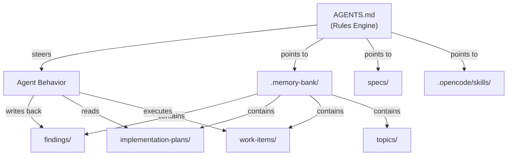
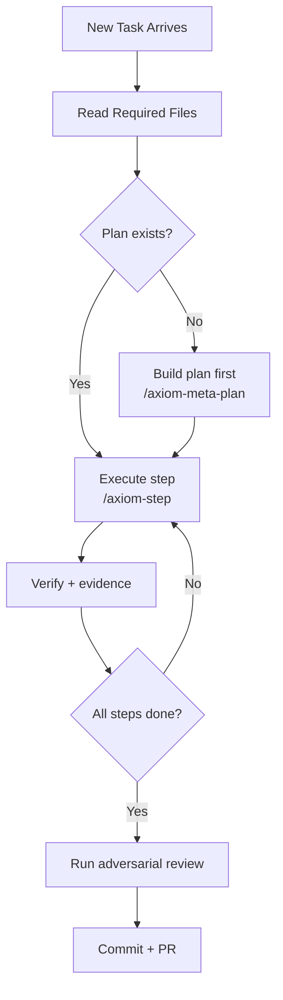
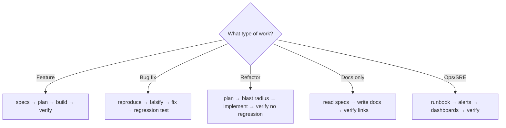
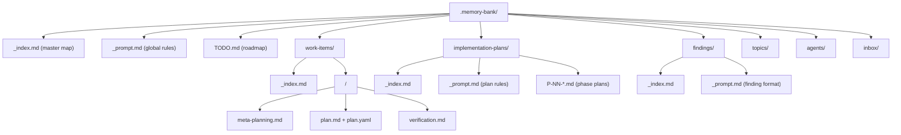
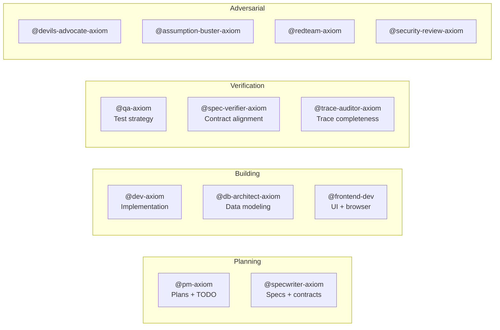
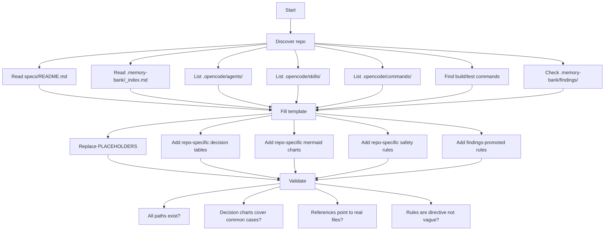

# AGENTS.md Builder (Rules Engine Pattern)

AGENTS.md is the **control surface** for agents operating in this repo. It doesn't teach — it steers. It encodes decision logic (mermaid), directive rules, and reference pointers (mostly into `.memory-bank/`) so the agent knows what to do, what not to do, and where to find depth.

## Philosophy



The agent reads AGENTS.md at session start. Everything it needs to navigate the repo is either:
1. **Inline** — rules, decision charts, safety constraints (directly in AGENTS.md)
2. **Referenced** — nested lists of file paths the agent reads on demand (mostly `.memory-bank/`)

The file IS long. That's fine. It's structured for scanning with headers, mermaid charts, and nested depth lists. Length is acceptable when the content is **directive and navigable**.

## When to Load This Skill

- `/axiom-init` — Generate initial AGENTS.md
- `/axiom-bootstrap` — Refresh AGENTS.md from repo state
- `/axiom-onboarding` — Ensure AGENTS.md exists and is wired
- After adding new agents, skills, or major spec changes
- When recurring findings suggest agents are missing rules

## Template

Below is the full template. Adapt per-repo — fill in the `<PLACEHOLDERS>` and remove sections that genuinely don't apply.

---

### BEGIN TEMPLATE

```markdown
# <PROJECT_NAME> (Repository Agent Rules)

<1-3 sentences: what this repo is, what it produces, who operates here.>

---

## Decision Logic (How to Work Here)





---

## Required Reading (every task, in this order)

1. `specs/README.md` — spec inventory (what contracts exist)
2. `.memory-bank/_index.md` — knowledge map (where everything lives)
3. `.memory-bank/TODO.md` — current roadmap (what's in progress)
4. Relevant `.memory-bank/work-items/<id>/` for the active work item

---

## Rules (Directive — follow these unconditionally)

### Planning Rules

- **Before executing any work**: verify plan artifacts exist at `.memory-bank/work-items/<id>/`
  - `meta-planning.md` — scope, risks, decisions
  - `plan.md` — human-readable implementation plan
  - `plan.yaml` — machine-readable plan for step execution
  - If ANY are missing → build them first (load `axiom-meta-planning-contract` skill)
- **Steps come from plans**: every step you execute must trace to a plan step
- **Implementation plans stay aligned**: when TODO changes, check `.memory-bank/implementation-plans/`

### Process Rules

- Follow `specs/09-Baby-Steps-Methodology.md` — smallest meaningful change, validate each step
- Update `specs/` FIRST when behavior changes — specs are the contract
- Never claim work is done without recorded evidence (test output, command results)
- Never invent commit hashes, test results, or approvals

### Safety Rules

- **Never** commit secrets → redact as `[REDACTED]`; use env vars
- **Never** force-push or `reset --hard` → unless explicitly asked
- **Never** skip tests → run `<TEST_COMMAND>` before every commit
- **Never** write outside the repo boundary → use `_tmp/` for scratch
- **Always** include co-author trailer on commits
- **Always** `git pull --rebase` before committing
- **Always** use `git mv` for tracked file moves (not filesystem mv)

### Trace Rules

Every behavior boundary must include:
```
axiom:trace work_item=<ID> spec=<REF> plan=<phase/task/step> impl=<REF?> test=<REF?> doc=<REF?> ops=<REF?> evidence=<REF?>
```

---

## Build / Test / Verify (exact commands)

<TABLE_FORMAT — adapt per repo:>

| Action | Command | Expected |
|---|---|---|
| Unit tests | `<UNIT_TEST_COMMAND>` | All pass, <TIME_LIMIT> |
| Lint | `<LINT_COMMAND>` | Exit 0 |
| Type check | `<TYPECHECK_COMMAND>` | Exit 0 |
| Runtime smoke | `<RUNTIME_COMMAND>` | Reaches Tier 3+ |
| Integration | `<INTEGRATION_COMMAND>` | All pass (needs <DEPS>) |

---

## Decision Tables (resolve recurring choices)

### Where to Put New Files

| If the file is... | Put it in... | Reference |
|---|---|---|
| A new spec | `specs/NN-Title.md` | `specs/README.md` |
| A new skill | `.opencode/skills/<name>/SKILL.md` | Existing skill structure |
| A new agent | `.opencode/agents/<name>.md` | Agent frontmatter format |
| A new command | `.opencode/commands/<name>.md` | Command frontmatter format |
| Project knowledge | `.memory-bank/topics/<topic>/` | Map-of-maps pattern |
| Work item state | `.memory-bank/work-items/<id>/` | Work item structure |
| A finding | `.memory-bank/findings/<category>/` | Findings prompt |

### When to Run Which Command

| Situation | Command | Outcome |
|---|---|---|
| Starting new work | `/axiom-intake` or `/axiom-work-item` | Creates plan artifacts |
| Need a detailed plan | `/axiom-meta-plan` | Produces meta-planning + plan.md + plan.yaml |
| Executing steps | `/axiom-step-loop` | Runs plan steps with verification |
| Verifying work | `/axiom-verify` | Independent verification pass |
| Refreshing roadmap | `/axiom-roadmap-refresh` | Updates TODO + implementation plans |
| Checking status | `/axiom-sitrep` | Situation report |

---

## Memory Bank Navigation (reference map)

The memory bank is the repo's long-term knowledge store. Navigate using `_index.md` files at each level.



### Key References (nested depth)

- `.memory-bank/_prompt.md` — global memory bank rules
  - `.memory-bank/_index.md` — master navigation map
  - `.memory-bank/TODO.md` — current roadmap with checkboxes
  - `.memory-bank/work-items/`
    - `_index.md` — all work items
    - `_current.md` — active work item pointer
    - `<id>/meta-planning.md` — scope and decisions
    - `<id>/plan.md` — readable plan
    - `<id>/plan.yaml` — executable plan
    - `<id>/verification.md` — evidence of completion
    - `<id>/findings-backlog.md` — pending fixes
  - `.memory-bank/implementation-plans/`
    - `_index.md` — all phase-level plans
    - `_prompt.md` — plan format rules
    - `P-NN-*.md` — individual phase plans
  - `.memory-bank/findings/`
    - `_index.md` — all findings by category
    - `_prompt.md` — how to write findings
    - `adversarial/` — adversarial review findings
    - `anti-patterns/` — discovered anti-patterns
    - `process/` — process improvement notes
    - `agent-reflections/` — agent self-improvement
  - `.memory-bank/topics/` — cross-project evergreen knowledge
  - `.memory-bank/agents/` — per-agent operating knowledge
  - `.memory-bank/inbox/` — agent-to-agent messages

---

## Findings & Self-Improvement

Agents accumulate findings, patterns, and self-improvement notes in the memory bank.

**Do not flood this file with findings.** Instead:
- Write findings to `.memory-bank/findings/` (see `_index.md` there)
- When a finding surfaces a rule ALL agents should follow → promote it to this file's Rules section
- Each finding type has its own subfolder with `_index.md` and `_prompt.md`

**When to write a finding:**
- Recurring mistake, friction point, or anti-pattern discovered
- Adversarial agent surfaces a gap, risk, or assumption failure
- Self-improvement loop produces a rule change

**Finding index:** `.memory-bank/findings/_index.md`

---

## Agent Roster (who does what)

<DECISION_CHART — which agent handles which work:>



### Full Agent Reference

- Core build: `.opencode/agents/` (see individual agent files for full prompts)
- Skills catalog: `.opencode/skills/` (load on demand via `skill` tool)
- Commands catalog: `.opencode/commands/` (invoke via `/command-name`)

---

## Deep Guidance (load skills on demand)

| Topic | Skill | When to load |
|---|---|---|
| Planning contract | `axiom-meta-planning-contract` | Before creating any plan |
| Plan schema | `axiom-plan-schema` | When writing plan.yaml |
| Implementation plans | `axiom-implementation-plans` | When updating phase plans |
| Test quality | `test-quality-gates-axiom` | When writing/reviewing tests |
| Baby steps | `baby-steps-methodology` | During implementation |
| Writing style | `writing-style-system-axiom` | When producing human-facing text |
| Security review | `security-review-axiom` | When touching auth/secrets/PII |
| Traceability | `traceability-doctrine` | When adding trace markers |
| Git commits | `git-commit-writing-axiom` | Before any git operation |
| Adversarial review | `adversarial-review-axiom` | Before claiming work complete |

---

## Workspace Boundary (hard rule)

All paths MUST resolve inside the repository root. Agents operating outside trigger harness kill.
- Use `_tmp/` inside the repo for scratch
- Use `workdir` parameter instead of `cd`
- Never access `~/`, `/tmp/`, or paths outside repo root

---

## Self-Management (this file is alive)

This AGENTS.md is a living document that the agent maintains itself. You are expected to:

- **Expand it** when you discover rules, patterns, or references that would help future sessions
- **Update it** when the repo evolves (new agents, skills, commands, conventions)
- **Promote findings** from `.memory-bank/findings/` into the Rules section when they recur 3+ times
- **Add decision tables** when you find yourself repeatedly making the same routing decision
- **Add mermaid charts** when a workflow is complex enough to benefit from visual logic
- **Remove stale rules** that no longer apply (move them to `.memory-bank/findings/` as archived)

**When to self-update AGENTS.md:**
- After completing a work item that changed repo structure
- After discovering a pattern that all agents should follow
- After adding new agents, skills, or commands
- After a finding gets promoted to a rule

**How to self-update:**
- Edit this file directly (it's yours to manage)
- Keep structure: headers → mermaid → nested lists → tables
- Keep references pointing to real paths (verify with glob/read)
- After updating, also update `.memory-bank/_index.md` if navigation changed

---

## Memory Bank Updates (CRITICAL — capture changes)

After ANY significant work, update the memory bank. This is how the system learns and retains context across sessions.

**Preferred:** Call `@memory-bank-axiom` — it handles structure, indexes, and invariants.
**Acceptable:** Write directly to `.memory-bank/` following the map-of-maps rules.

**When to update memory bank:**
- Work item completed or progressed → update `work-items/<id>/verification.md`
- Decision made → write to `.memory-bank/decisionLog.md` or `decisions/`
- New pattern discovered → write to `.memory-bank/findings/` or `topics/`
- Agent learned something → write to `.memory-bank/agents/<agent>/`
- System architecture changed → update `.memory-bank/systemPatterns.md`
- Specs or plans changed → update relevant implementation plans

**What gets lost if you skip this:** Future sessions start cold. They repeat mistakes. They re-discover things you already know. The memory bank is the only thing that survives between sessions.
```

### END TEMPLATE

---

## How to Fill the Template

When generating AGENTS.md for a specific repo:



### Step-by-Step

1. **Discover** — Read the repo's key files to understand structure, conventions, agents, skills
2. **Fill identity** — What is this repo? 1-3 sentences.
3. **Fill decision logic** — Mermaid charts showing how work flows. Adapt the template charts to the actual workflow.
4. **Fill required reading** — The 3-5 files agents should always read first
5. **Fill rules** — Directive rules. Pull from:
   - Existing conventions (if migrating from a previous AGENTS.md)
   - `.memory-bank/findings/` (recurring issues → promote to rules)
   - Safety/boundary constraints from the project
6. **Fill build/test** — Exact commands from the repo's actual test setup
7. **Fill decision tables** — Where do files go? When to use which command? Which agent for which work?
8. **Fill memory bank map** — Adapt the nested reference list to the actual folder structure
9. **Fill agent roster** — From `.opencode/agents/` directory listing
10. **Fill skills table** — Most-used skills from `.opencode/skills/`

### What Makes a Good Rule

Rules in AGENTS.md must be:
- **Directive** — tells the agent what TO DO (not just what to avoid)
- **Specific** — references exact paths, commands, or patterns
- **Enforceable** — agent can verify compliance (not "write good code")
- **Paired** — every prohibition has a corresponding "do instead"

Bad: "Follow best practices for testing"
Good: "Run `cd .axiom && python -m pytest tests/test_*.py -q --timeout=45` before marking any step complete"

Bad: "Don't break things"
Good: "Never modify `specs/` without also updating the corresponding implementation; never modify implementation without verifying specs don't need updating"

## Maintenance Triggers

AGENTS.md should be refreshed when:

| Event | What to update |
|---|---|
| New agents added | Agent roster + decision chart |
| New skills added | Deep guidance table |
| New commands added | Decision tables |
| Build/test commands change | Build/Test section |
| Recurring finding (3+) | Promote to Rules section |
| Memory bank restructure | Memory bank navigation map |
| New specs added | Required reading + decision tables |
| Workflow changes | Mermaid decision charts |

## Key Principles

1. **AGENTS.md is a rules engine** — it steers, it doesn't teach. Teaching lives in skills and specs.
2. **References over content** — point to `.memory-bank/`, `specs/`, `skills/` rather than duplicating their content.
3. **Mermaid charts encode decision logic** — when the agent faces a choice, a flowchart resolves it faster than prose.
4. **Nested depth lists for navigation** — the agent scans these to find what it needs without reading everything.
5. **Living document** — findings get promoted to rules; rules that stop mattering get demoted to findings archive.
6. **Length is fine when structured** — use headers, charts, and tables so the agent can skip to what's relevant.
