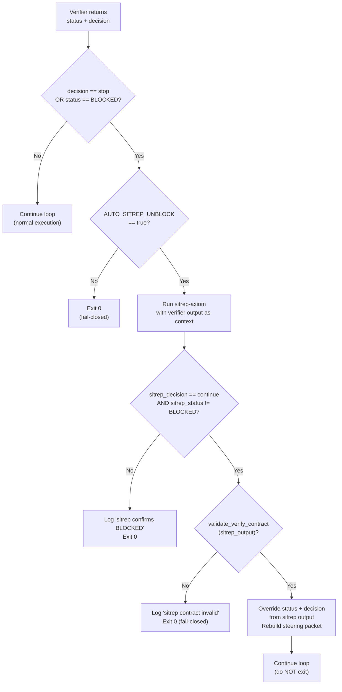

# Loop Self-Unblocking (Portable)

This skill defines the autonomous self-unblocking mechanism for the Axiom builder+verifier loop.

Source spec: `specs/49-Loop-Self-Unblocking.md`

---

## Problem Statement

The Ralph meta-loop (builder + verifier-captain) stops when the verifier returns `DECISION: stop` or `STATUS: BLOCKED`. This is correct fail-closed behavior for genuinely blocked work, but it also fires unnecessarily when:

| Scenario | What happened | Why the loop stopped |
|---|---|---|
| New work planned after verifier ran | Verifier sees old state | Says BLOCKED, but unblocked work exists |
| Phase completed, next phase queued | `_current.md`/`TODO.md` updated | Verifier's steering packet doesn't reflect it |
| Only credential-gated items visible | Verifier only knows about blocked items | Parallel non-credential-gated work exists |

The self-unblocking mechanism attempts to route to unblocked work before stopping.

---

## Core Mechanism

```
After verifier returns BLOCKED/stop:

  IF AUTO_SITREP_UNBLOCK == true:
    Run @sitrep-axiom with verifier output as context
    
    IF sitrep says "continue" AND status != BLOCKED:
      IF sitrep output passes contract validation:
        Override steering packet from sitrep
        Continue loop (do NOT exit)
      ELSE:
        Log "sitrep contract invalid"
        Exit 0 (fail-closed)
    ELSE:
      Log "sitrep confirms BLOCKED"
      Exit 0
  ELSE:
    Exit 0 (AUTO_SITREP_UNBLOCK=false)
```

### Key Rules

| Rule | Detail |
|---|---|
| **One attempt per event** | Sitrep runs exactly once per BLOCKED/stop event. No recursive retry. |
| **Contract validation required** | Sitrep output MUST pass schema validation before being trusted |
| **Fail-closed on invalid output** | Malformed sitrep output = loop stops |
| **No work fabrication** | Sitrep MUST NOT invent unblocked work or fabricate `continue` decisions |
| **Routing only** | Sitrep routes to existing work; it does NOT execute builder work |

---

## Sitrep Output Contract

The sitrep unblock pass MUST emit output conforming to the verifier-captain steering contract:

```
STATUS: PASS|FAIL|BLOCKED
DECISION: continue|steer|stop
STEP_AUDITED: <step-id or "sitrep-unblock">
NEXT_BUILDER_STEP:
- <one-line description of the next step>
NEXT_BUILDER_PROMPT:
- <prompt text for the builder>
EVIDENCE:
- <path to evidence file or "none">
```

### When `DECISION: continue`

- `STATUS` MUST be `PASS` (not `BLOCKED` or `FAIL`)
- `NEXT_BUILDER_STEP` MUST reference a real, unblocked step in `_current.md` or `TODO.md`
- `NEXT_BUILDER_PROMPT` MUST be actionable and specific enough for the builder to execute

### When `DECISION: stop`

- `STATUS` SHOULD be `BLOCKED`
- `NEXT_BUILDER_STEP` SHOULD describe what is blocking (e.g., "Provision Jira credentials")
- `NEXT_BUILDER_PROMPT` SHOULD describe the human action required to unblock

---

## Sitrep Unblock Pass Scope

### Authorized Actions

- Read `.memory-bank/work-items/_current.md`
- Read `.memory-bank/TODO.md`
- Read the verifier steering packet
- Update `_current.md` to point at unblocked work
- Update `TODO.md` routing section if needed
- Emit a steering packet directing the builder to unblocked work

### NOT Authorized

- Execute builder work (implement code, write tests, etc.)
- Modify specs, plans, or verification artifacts
- Override governance-level blocks (missing credentials, human approval gates)
- Claim work is done without evidence

---

## Idle-Time Spec Conformance Sweep Integration

When the sitrep detects that all unchecked TODO items are credential-gated or explicitly deferred, it MUST check for idle-time sweep eligibility before declaring terminal BLOCKED:

```
1. List spec files in specs/ (excluding README.md, _index.md, _prompt.md, _inputs/)
2. Determine which specs have NOT been audited in the current session
3. IF unswept specs exist:
   a. Pick one spec (non-deterministic, e.g., timestamp-based modulo)
   b. Emit STATUS: PASS, DECISION: continue
   c. Set NEXT_BUILDER_STEP to idle-time sweep task for selected spec
   d. Set NEXT_BUILDER_PROMPT to spec audit instruction
4. IF ALL specs swept with no gaps:
   Emit STATUS: BLOCKED, DECISION: stop
```

**Rationale**: Credential-gated items are not "unchecked" in the sweep-eligibility sense — they are checkpointed and waiting for external input. The loop should use idle time to discover and close spec alignment gaps.

---

## Configuration

### Environment Variables

| Variable | Default | Description |
|---|---|---|
| `AUTO_SITREP_UNBLOCK` | `true` | Enable/disable sitrep unblock pass |
| `SITREP_AGENT` | `sitrep-axiom` | Agent to use for unblock pass |
| `SITREP_MODEL` | agent file's model | Model override for sitrep agent |

### CLI Flags

| Flag | Description |
|---|---|
| `--no-sitrep-unblock` | Disable sitrep unblock pass (same as `AUTO_SITREP_UNBLOCK=false`) |
| `--sitrep-agent NAME` | Override sitrep agent |
| `--sitrep-model MODEL` | Override sitrep model |
| `--thinking` | Propagates to sitrep invocation (REQ-LSU-010) |

### Opt-Out Use Cases

| Use Case | Why opt out |
|---|---|
| Debugging | Inspect BLOCKED state without self-correction |
| CI/CD | Pipeline should stop on BLOCKED for human review |
| Testing | Testing the BLOCKED exit path itself |

---

## Log Artifacts

| Artifact | Path | When written |
|---|---|---|
| Sitrep unblock log | `${LOG_DIR}/${ts}_meta-cycle-${i}_sitrep-unblock.log` | Every sitrep unblock pass |
| Sitrep steering packet | `${LOG_DIR}/${ts}_meta-cycle-${i}_sitrep-steering.txt` | When sitrep returns `continue` |

Both files MUST be retained for auditability.

---

## Applicability by Operating Mode

| Mode | Self-Unblocking Applies? | Reason |
|---|---|---|
| **Local Automated** | Yes | Loop runner controls execution |
| **Full Automated** | Yes | Control plane invokes loop runner |
| **Local CLI** | No | Human drives the loop |
| **Single-step** (`--single`) | No | Loop exits after one cycle regardless |

---

## Interaction with Other Specs

| Spec | Relationship |
|---|---|
| `specs/12-Retry-And-Escalation.md` | Retry governs retrying the *same* step; self-unblocking routes to a *different* step |
| `specs/46-Broken-Arrow-Emergency-Swarm.md` | Self-unblocking is lightweight first-pass; Broken Arrow is the escalation for hard-blocked states |
| `specs/29-Operating-Modes.md` | Self-unblocking applies to automated modes only |
| `specs/10-Lifecycle-State-Machine.md` | Sitrep does NOT change work item lifecycle state; only changes the loop routing pointer (`_current.md`) |

---

## Security Constraints

| Constraint | Rule |
|---|---|
| No write access to specs/code/tests | Sitrep is read-heavy, write-light (only `_current.md` and `TODO.md`) |
| No credential provisioning | Credential-gated unblocking is a human action |
| Contract validation required | Malformed output = fail-closed (BLOCKED) |
| Prompt-injection defense | Same rules as all other agents (`specs/43-Input-Sanitization-And-Untrusted-Content.md`) |

---

## Flow Diagram



---

## Acceptance Criteria

| ID | Criterion | Verification |
|---|---|---|
| AC-LSU-1 | Loop continues when sitrep finds unblocked work | BLOCKED verifier + `_current.md` with unblocked work; loop continues |
| AC-LSU-2 | Loop stops when sitrep confirms BLOCKED | BLOCKED verifier + all TODO items credential-gated; loop exits 0 |
| AC-LSU-3 | `--no-sitrep-unblock` disables the pass | Loop exits immediately on BLOCKED without calling sitrep |
| AC-LSU-4 | Invalid sitrep output stops the loop | Mock sitrep returning malformed output; loop exits 0 (fail-closed) |
| AC-LSU-5 | Sitrep log written to `$LOG_DIR` | `*_sitrep-unblock.log` exists after BLOCKED cycle |
| AC-LSU-6 | Sitrep steering packet written when continuing | `*_sitrep-steering.txt` exists after sitrep returns `continue` |
| AC-LSU-7 | `--thinking` propagates to sitrep | Sitrep invocation includes `--thinking` flag |
| AC-LSU-8 | `SITREP_AGENT` env var overrides agent | Sitrep invoked with `--agent custom-agent` |

---

## Open Decisions

| ID | Decision | Status |
|---|---|---|
| OD-LSU-1 | Should sitrep also handle `DECISION: steer` (not just `stop`)? | Open |
| OD-LSU-2 | Should sitrep be allowed to create new work items (not just route)? | Open |
| OD-LSU-3 | Should there be a max-unblock-attempts counter? | Open |
