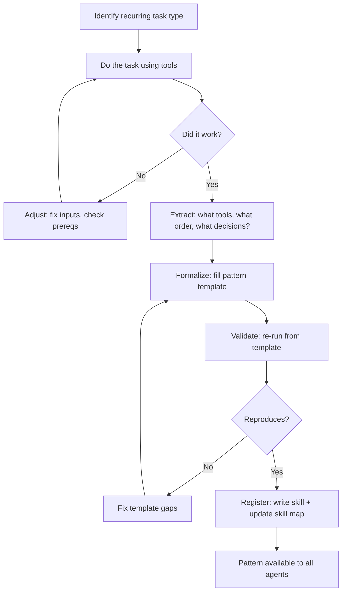
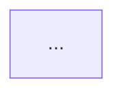

# Pattern Generator — Build Reusable Multi-Tool Workflows

A **pattern** is a reusable, documented workflow that combines 2+ Axiom plugin tools into a cohesive task-solving approach. Patterns are how agents learn from experience and share knowledge about effective tool combinations.

**Spec**: `specs/121-Pattern-Generator.md`
**This skill**: `.opencode/skills/axiom-pattern-generator/SKILL.md`
**Reference**: `.opencode/skills/axiom-pattern-generator/REFERENCE.md`

<!-- axiom:trace work_item=pattern-generator-01 spec=specs/121-Pattern-Generator.md -->

---

## When to Load This Skill

Load when:
- You're about to do a multi-tool task and want to formalize it as a pattern
- You notice you're repeating the same tool sequence across different tasks
- Another agent asks "how do I combine tool X with tool Y?"
- You want to build a new workflow that doesn't exist yet
- You need to teach an agent a reusable approach

---

## The Pattern Generation Loop



---

## Step 1: Identify the Task Type

Before generating a pattern, classify what you're doing:

| Task Type | Signature | Likely Tools |
|-----------|-----------|--------------|
| **Investigate** | "What happened? What changed? What broke?" | ShellOps + Code-Intel + Graph + Tree + Stash |
| **Explore** | "How does X work? Who calls Y?" | Code-Intel + Tree + Stash |
| **Monitor** | "Watch for Z, react when it happens" | ShellOps (watch) + Graph + Stash |
| **Plan** | "How to safely change X across N files?" | Graph + Code-Intel + Tree + Stash |
| **Handoff** | "Pass context to another agent/session" | Stash + Tree + Graph |
| **Learn** | "Track upstream changes, ingest new knowledge" | Feed + Tree + Code-Intel |
| **Verify** | "Prove X is true with evidence" | ShellOps (terminal) + Tree + Stash |

---

## Step 2: Do the Task (Observe Yourself)

Execute the task using direct MCP tool calls. As you work, track:

1. **Which tool did you call?** (exact tool name)
2. **What input did you provide?** (field names, types)
3. **What output did you get?** (shape, key fields)
4. **What decision did you make based on the output?** (pivot point)
5. **What went wrong and how did you fix it?** (adjustment)

### Critical Rule: Use Direct Tool Calls

```
✅ CORRECT — Direct MCP tool call:
   Call graph_create with { name: "...", nodes: [...] }
   Call tree.commit with { file: "...", content: "...", message: "..." }
   Call stash.push with { summary: "...", tags: "tag1,tag2" }
   Call code-intel with { operation: "query", symbol: "..." }

❌ WRONG — Writing a script and running it:
   Write _tmp/do-stuff.ts → bun run _tmp/do-stuff.ts
   (This is for testing ONLY, never the pattern itself)
```

**Why?** Patterns must be reproducible by any agent in any session. MCP tool calls work everywhere. Scripts require filesystem access, specific runtimes, and break across contexts.

---

## Step 3: Extract the Pattern

After successfully completing the task, extract these elements:

### 3a. Tool Chain (ordered)

```yaml
tool_chain:
  - step: 1
    tool: graph_create
    purpose: "Structure the investigation as a DAG"
    input: { name: "string", nodes: "Node[]" }
    output: { graph_id: "string", node_count: "number" }
    on_fail: "retry once; fall back to flat task list"
    
  - step: 2
    tool: code-intel (operation: query)
    purpose: "Find symbols related to the change"
    input: { symbol: "string" }
    output: { matches: "Match[]" }
    on_fail: "warn; proceed with file-level analysis only"
```

### 3b. Pivot Points (decisions)

```yaml
pivot_points:
  - after_step: 2
    condition: "matches.length == 0"
    action: "Skip blast-radius step; mark as 'no structural impact'"
    
  - after_step: 3
    condition: "risk_level == 'HIGH'"
    action: "Add security review node to graph; escalate"
```

### 3c. On-Track / Off-Track Signals

```yaml
signals:
  on_track:
    - "graph_create returns graph_id (not error)"
    - "tree.commit returns status: committed"
    - "stash.push returns stash_id (not error)"
    - "Each step completes in < 10s"
    
  off_track:
    - "Any tool returns { error: ... }"
    - "Tool returns unexpected type (e.g., tags expects string, got array)"
    - "Service unreachable (ShellOps daemon down)"
    - "3+ consecutive retries on same step"
    
  abort_conditions:
    - "Prerequisite service cannot be started"
    - "Required tool not available in this session"
    - "Data dependency from previous step is null/undefined"
```

---

## Step 4: Formalize (Fill the Template)

Every pattern MUST include these sections. Copy this template:

````markdown
---
name: pattern-<name>
description: <one-line description>
version: "1.0"
tags:
  vertical: [<domain tags>]
  category: pattern
  core: false
spec: specs/121-Pattern-Generator.md
---

# Pattern: <Name>

<2-3 sentence description of what this pattern does and when to use it.>

## Prerequisites

| Requirement | How to Verify | If Missing |
|-------------|---------------|------------|
| ShellOps daemon running | `curl http://127.0.0.1:9876/health` → `{"status":"ok"}` | Start daemon |
| Tree Memory initialized | `tree.status` → `initialized: true` | Call `tree.init` |
| Graph Harness available | `graph_status` → returns recent_graphs | Check DB path |

## Tool Chain

| Step | Purpose | Tool | Key Input | Key Output | On Failure |
|------|---------|------|-----------|------------|------------|
| 1 | ... | `tool_name` | `{field: type}` | `{field: type}` | action |

## Flow Diagram



## Pseudocode

```text
FUNCTION pattern_name(inputs):
  // Prerequisites check
  VERIFY prerequisites OR ABORT("missing: ...")
  
  // Step 1
  result_1 = CALL tool_1(inputs)
  IF result_1.error THEN RETRY(1) OR ABORT
  CHECK on_track_signal(result_1)
  
  // Pivot point
  IF condition(result_1) THEN
    // Branch A
  ELSE
    // Branch B
  
  // Step 2
  result_2 = CALL tool_2(result_1.output)
  ...
  
  RETURN { status: "complete", artifacts: [...] }
```

## On-Track / Off-Track Signals

| Signal | Type | Indicator | Response |
|--------|------|-----------|----------|
| ... | on_track | ... | Continue |
| ... | off_track | ... | Fix input / retry |
| ... | abort | ... | Stop; report partial |

## Adjustment Protocol

```text
IF off_track:
  1. Identify failed step
  2. Check REFERENCE.md for correct input format
  3. Check prerequisites (service up? plugin init?)
  4. Fix and retry (max 3 attempts)
  5. IF still failing → abort, report failure point + partial results
```

## Example Execution Trace

```
→ graph_create({ name: "...", nodes: [...] })
← { graph_id: "gh_abc123", node_count: 5 }
  ✓ ON TRACK: graph_id present

→ code-intel query({ symbol: "..." })
← { matches: [{ name: "...", file: "...", line: 42 }] }
  ✓ ON TRACK: matches.length > 0

→ tree.commit({ file: "findings/...", content: "...", message: "..." })
← { status: "committed" }
  ✓ ON TRACK: status == "committed"

COMPLETE: 3/3 steps succeeded
```
````

---

## Step 5: Validate (Re-Run From Template)

Before registering, verify the pattern reproduces:

1. Start from a clean state (no leftover artifacts)
2. Follow the template step-by-step using ONLY the documented tool calls
3. Verify each on-track signal fires
4. Intentionally trigger one off-track signal to test recovery
5. Confirm the end state matches the example

---

## Step 6: Register the Pattern

1. **Write the skill**: `.opencode/skills/<pattern-name>/SKILL.md`
2. **Write the reference**: `.opencode/skills/<pattern-name>/REFERENCE.md`
3. **Write the readme**: `.opencode/skills/<pattern-name>/README.md`
4. **Update skill map**: Add entry to `.opencode/skills/axiom-skill-map/SKILL.md`
5. **Tag for discovery**: Ensure `tags.category: pattern` is set

---

## Common Mistakes (Off-Track Patterns)

| Mistake | Why It Happens | Fix |
|---------|---------------|-----|
| Writing scripts instead of tool calls | Old habit; feels "safer" | Use MCP tools directly; scripts for testing only |
| Missing `tags` type in stash.push | `tags` expects comma-separated string, not array | `tags: "tag1,tag2"` not `tags: ["tag1","tag2"]` |
| Tree commit with undefined file | Variable not set before calling tool | Check all inputs are defined before tool call |
| Graph with 0 edges | `depends_on` not passed in node creation | Explicitly wire edges in the nodes array |
| Code-Intel query returns empty | Symbol name doesn't match qualified name | Use `search` (fuzzy) before `callers` (exact) |
| ShellOps watch query by name not ID | Watch returns `watch_id`, query needs that ID | Store `watch_id` from create response, use it in query |

---

## Pattern Naming Convention

```
pattern-<verb>-<domain>
```

Examples:
- `pattern-investigate-changes`
- `pattern-explore-codebase`
- `pattern-monitor-logs`
- `pattern-plan-refactor`
- `pattern-handoff-context`

---

## Relation to Other Skills

| Skill | Relationship |
|-------|-------------|
| `axiom-skill-map` | Patterns are registered here for discovery |
| `code-graph-intelligence-axiom` | Used BY patterns for structural analysis |
| `context-stash-axiom` | Used BY patterns for context handoff |
| `tree-memory-axiom` | Used BY patterns for knowledge storage |
| `chrome-devtools-mcp` | Used BY patterns for UI verification |
| `protocol-testing` | Used BY patterns for API verification |

This skill is the **generator**. The others are **building blocks**.
