# Skill Map — Structured Skill Routing

This skill provides a structured decision tree that deterministically routes problem types to recommended skill sets. Instead of scanning 100+ skill descriptions and guessing, traverse the tree: "given a problem that looks like X, load skills Y and Z."

The skill map is **advisory, not mandatory**, except for explicit `conditional_required` entries in `tree.yaml`. Traverse the tree for recommendations, then apply judgment over final skill selection. When you discover a routing gap (a skill was needed but not suggested), feed back into the self-maintenance protocol.

axiom:trace work_item=skill-map-01 spec=specs/85-Skill-Map-Decision-Tree.md

---

## Quick Start

1. **Read the problem** — what is the user asking for?
2. **Match signals** — scan domain `signals` lists for keyword overlap (case-insensitive substring)
3. **Pick problem type** — within matched domain(s), find the closest problem type
4. **Load recommended skills** — always include `global` skills plus the problem-type skills
5. **Apply judgment** — you don't have to load every recommended skill; pick what's relevant

---

## Tree Format

The decision tree lives in `tree.yaml` (same directory as this file). Structure:

```yaml
version: 1          # Monotonic integer, bumped on every change
updated: "YYYY-MM-DD"

global:
  skills: [...]     # Always recommended regardless of domain match
  conditional_required:
    - when: "..."     # Harness/runtime condition
      skills: [...]   # Must load when the condition is true

domains:
  <domain-name>:
    description: "..."
    signals: [...]           # Keywords that indicate this domain is relevant
    problem_types:
      <problem-type-name>:
        description: "..."
        skills: [...]        # Ordered list — first = highest priority
        agents: [...]        # Optional — recommended agents
        conditions: [...]    # Optional — contextual hints
```

### Key Rules

| Rule | Detail |
|------|--------|
| **Signal matching** | Case-insensitive substring match against the problem description |
| **Multi-domain match** | Return union of skill sets from all matching domains, deduplicated |
| **No match** | Fall back to `axiom-capability-surface` (flat catalog); write feedback message |
| **Conditions** | Optional hints — evaluate only if info is already available; never trigger new scans |
| **Advisory** | The tree recommends; the agent decides what to actually load |
| **Conditional required** | Entries in `global.conditional_required` are mandatory when the harness/runtime condition is true |
| **Global skills** | Always included: `baby-steps-methodology`, `traceability-doctrine`, `evidence-bundle-schema`, `axiom-confidence-scoring`, `axiom-retry-escalation`, `axiom-mission-north-star` |

---

## Traversal Algorithm

```text
function recommend_skills(problem_description):
  matched_skills = set(global.skills)
  matched_agents = set()
  matched_domains = []

  for conditional in global.conditional_required:
    if condition_matches_runtime(conditional.when):
      matched_skills.update(conditional.skills)

  for domain in tree.domains:
    if any signal in domain.signals matches problem_description:
      matched_domains.append(domain)
      for problem_type in domain.problem_types:
        if problem_type.description is relevant to problem_description:
          matched_skills.update(problem_type.skills)
          matched_agents.update(problem_type.agents)

  if matched_domains is empty:
    # Fallback: load axiom-capability-surface for flat catalog
    matched_skills.add("axiom-capability-surface")
    write_feedback_message(problem_description, domain=null)

  return {skills: matched_skills, agents: matched_agents, domains: matched_domains}
```

### Runtime-Aware Requirement

If the harness says the active model is OpenAI-provided or GPT-family, load `gpt-paragraph-first-writing-axiom` for human-facing writing. This is a required correction layer, not a style preference, because GPT-family models are prone to over-structured “list brain” unless explicitly steered toward paragraph-first answers.

---

## Domains (21)

| # | Domain | Description | Problem Types |
|---|--------|-------------|---------------|
| 1 | `security` | Threat modeling, secrets, penetration testing | security-review, security-implementation, penetration-validation, adversarial-review |
| 2 | `privacy` | PII, GDPR/CCPA/HIPAA, data retention, consent | privacy-review, privacy-implementation |
| 3 | `api` | API design, contracts, testing, versioning | api-design, api-testing, api-versioning |
| 4 | `testing` | Test strategy, quality gates, conformance, TDD | test-strategy, conformance-testing, regression-testing, protocol-testing, idle-sweep |
| 5 | `observability` | Metrics, logging, tracing, dashboards, alerts | metrics-design, dashboard-design, alert-engineering, distributed-tracing, logging, diagnosis, predictive-observability |
| 6 | `operations` | Deploy safety, SLOs, runbooks, incidents, chaos | sre-setup, runbook-creation, incident-response, chaos-engineering, emergency-swarm |
| 7 | `infrastructure` | Cloud, IaC, IAM, networking, containers, cost | cloud-architecture, cost-optimization |
| 8 | `database` | Data modeling, migrations, indexing | data-modeling, migration |
| 9 | `frontend` | UI, UX, accessibility, design systems, browser | frontend-development, accessibility-review, ux-writing |
| 10 | `planning` | Specs, plans, PRDs, roadmaps, gap analysis | spec-writing, spec-verification, planning, todo-management, prd-processing, gap-analysis, plan-history |
| 11 | `writing` | Docs, commits, PRs, Jira, RFCs, ADRs, changelogs | writing-routing, documentation, commit-messages, pull-requests, jira-operations, rfcs, adrs, changelogs, spec-style, runbook-style |
| 12 | `cicd` | CI/CD pipelines, releases, versioning | pipeline-setup, release-management, npm-publish, batch-commits |
| 13 | `dependencies` | Upgrades, CVEs, upstream tracking | dependency-upgrade, upstream-tracking |
| 14 | `performance` | Benchmarks, profiling, load testing, budgets | performance-analysis, performance-budgets |
| 15 | `repository` | Repo setup, onboarding, scaffolding, git hygiene | axiom-setup, repo-layout, git-hooks, multi-repo, git-history-backfill |
| 16 | `memory` | Memory bank, findings, glossary, knowledge | memory-operations, glossary |
| 17 | `orchestration` | Agent coordination, swarms, loops, sitreps | swarm-coordination, ralph-loop, prompt-mirror, sitrep, intake-processing, autonomous-intake, data-passing |
| 18 | `adversarial` | Challenge assumptions, red-team, simplify, contradictions | assumption-busting, devils-advocate, red-team, contradiction-detection, simplicity-enforcement, decision-archaeology |
| 19 | `platform` | Axiom internals, commands, lifecycle, forensics | command-authoring, lifecycle-management, operating-modes, runtime-state, cost-tracking, forensics, self-reporting, capability-discovery, copilot-guidance, loop-unblocking, multi-channel, opencode-integration, tool-cli, local-dev, prototype-management |
| 20 | `personal` | Personal OS, Notion, image generation | personal-os, notion-integration, image-generation |
| 21 | `implementation` | Code, features, bug fixes, refactoring | feature-implementation, best-practices, duplicate-prevention |

---

## Self-Maintenance Protocol

When you load a skill that the tree did NOT suggest for your current problem, write a feedback message:

**Where:** `.memory-bank/inbox/memory-bank-axiom/`

**Format:**
```yaml
type: skill-map-feedback
timestamp: "2026-04-12T14:30:00Z"
problem_description: "Add new REST API endpoint with authentication"
matched_domain: "api"
matched_problem_type: "api-design"
skill_loaded: "distributed-tracing-axiom"
reason: "Service already has OpenTelemetry instrumented; new endpoint needs trace context propagation"
suggested_action: "add distributed-tracing-axiom to api/api-design skill set"
```

When no domain matches at all:
```yaml
type: skill-map-feedback
timestamp: "2026-04-12T14:30:00Z"
problem_description: "Set up Datadog integration for monitoring"
matched_domain: null
matched_problem_type: null
skill_loaded: "sre-ops-axiom"
reason: "No domain matched 'Datadog integration'"
suggested_action: "create new domain or add 'Datadog' signal to observability domain"
```

Feedback is processed by `/axiom-skill-map update`. Updates are additive — skills are added but never removed without `--prune` and human confirmation.

---

## Domain Map (Mermaid)

```mermaid
graph LR
  SM[Skill Map]:::root

  SM --> SEC[security]
  SM --> PRIV[privacy]
  SM --> API[api]
  SM --> TEST[testing]
  SM --> OBS[observability]
  SM --> OPS[operations]
  SM --> INFRA[infrastructure]
  SM --> DB[database]
  SM --> FE[frontend]
  SM --> PLAN[planning]
  SM --> WRITE[writing]
  SM --> CICD[cicd]
  SM --> DEPS[dependencies]
  SM --> PERF[performance]
  SM --> REPO[repository]
  SM --> MEM[memory]
  SM --> ORCH[orchestration]
  SM --> ADV[adversarial]
  SM --> PLAT[platform]
  SM --> PERS[personal]
  SM --> IMPL[implementation]

  SEC --> SEC1[security-review]
  SEC --> SEC2[security-implementation]
  SEC --> SEC3[penetration-validation]
  SEC --> SEC4[adversarial-review]

  PRIV --> PRIV1[privacy-review]
  PRIV --> PRIV2[privacy-implementation]

  API --> API1[api-design]
  API --> API2[api-testing]
  API --> API3[api-versioning]

  TEST --> TEST1[test-strategy]
  TEST --> TEST2[conformance-testing]
  TEST --> TEST3[regression-testing]
  TEST --> TEST4[protocol-testing]
  TEST --> TEST5[idle-sweep]

  OBS --> OBS1[metrics-design]
  OBS --> OBS2[dashboard-design]
  OBS --> OBS3[alert-engineering]
  OBS --> OBS4[distributed-tracing]
  OBS --> OBS5[logging]
  OBS --> OBS6[diagnosis]
  OBS --> OBS7[predictive-observability]

  OPS --> OPS1[sre-setup]
  OPS --> OPS2[runbook-creation]
  OPS --> OPS3[incident-response]
  OPS --> OPS4[chaos-engineering]
  OPS --> OPS5[emergency-swarm]

  PLAN --> PLAN1[spec-writing]
  PLAN --> PLAN2[planning]
  PLAN --> PLAN3[todo-management]
  PLAN --> PLAN4[prd-processing]
  PLAN --> PLAN5[gap-analysis]

  classDef root fill:#f9f,stroke:#333,stroke-width:2px;
```



---

## Coverage

Every skill installed in `.opencode/skills/` appears in at least one tree leaf. Run `/axiom-skill-map validate` to verify coverage and detect stale references.

---

## Related

- **Flat catalog**: `axiom-capability-surface` — comprehensive but not navigable; the skill map complements it
- **Spec**: `specs/85-Skill-Map-Decision-Tree.md`
- **Command**: `/axiom-skill-map` — display, query, update, validate
- **Feedback inbox**: `.memory-bank/inbox/memory-bank-axiom/`
