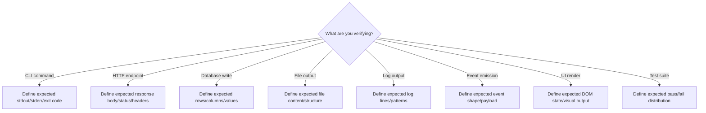
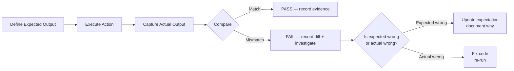
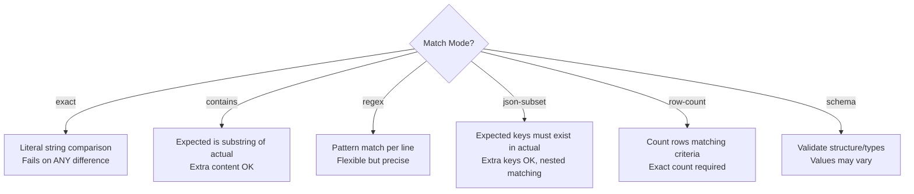
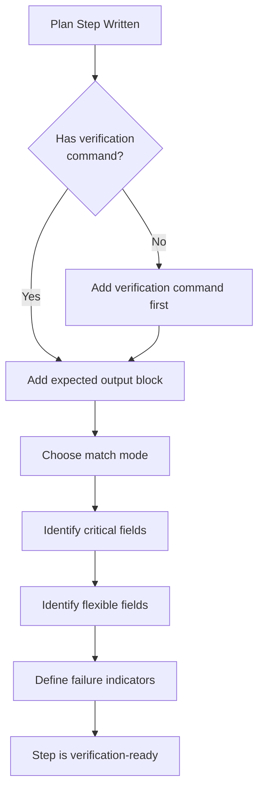

# Expected Output Verification (Portable)

> **"If you don't know what correct output looks like, you can't know if the system is working."**

This skill solves a specific gap: agents run code, tests pass, but nobody defined what the output SHOULD be. Without expected output declarations, verification becomes "it didn't crash" instead of "it produced correct results."

## When to Load This Skill



Load this skill when:
- Writing verification for a plan step (what does "passing" look like?)
- Running a command and needing to confirm the output is correct
- Verifying database state after a write operation
- Checking that an API returns the expected response shape and content
- Validating that logs contain (or don't contain) expected patterns
- Writing acceptance criteria that reference specific outputs
- Building regression tests (baseline output vs current output)

## Core Principle: Declare Before Execute



**Rule:** Before running any verification command, write down what you expect to see. This prevents the common failure where the agent sees unexpected output and rationalizes it as "probably fine."

## Expected Output Declaration Format

Every verification step should include an expected output block. Use this structure:

```markdown
### Expected Output: <step-id>

**Surface:** <CLI | HTTP | Database | File | Log | Event | UI>
**Command/Action:** `<exact command or action being verified>`

**Expected:**
```
<the literal or pattern-matched output you expect>
```

**Match mode:** <exact | contains | regex | json-subset | row-count | schema>
**Critical fields:** <which parts of the output MUST match exactly>
**Flexible fields:** <which parts may vary (timestamps, IDs, etc.)>
**Failure indicators:** <patterns that indicate something went WRONG>
```

## Surface-Specific Templates

### CLI Expected Output

```markdown
**Surface:** CLI
**Command:** `axiom run --work-item smoke-test --repo . --in-process`

**Expected exit code:** 0
**Expected stdout contains:**
```
[orchestrator] Starting run for work-item: smoke-test
[orchestrator] Run completed successfully
```

**Expected stderr:** empty (or warning-only)
**Failure indicators:**
- Exit code != 0
- "Error" or "FATAL" in stderr
- "traceback" in output
- Missing "Run completed" line (indicates premature exit)

**Flexible fields:** timestamps, run IDs, duration values
**Critical fields:** status messages, final completion line
```

### HTTP Response Expected Output

```markdown
**Surface:** HTTP
**Command:** `curl -sf http://127.0.0.1:8100/health`

**Expected status:** 200
**Expected headers:**
- `Content-Type: application/json`

**Expected body (json-subset):**
```json
{
  "status": "healthy",
  "version": "<any string>",
  "uptime_seconds": "<number > 0>"
}
```

**Match mode:** json-subset (extra fields allowed)
**Critical fields:** status must be "healthy", version must be present
**Flexible fields:** uptime_seconds (any positive number), extra fields
**Failure indicators:**
- Status != 200
- status field is "degraded" or "unhealthy"
- Missing version field
- Connection refused (server not running)
```

### Database State Expected Output

```markdown
**Surface:** Database
**Command:** `SELECT count(*), status FROM runs WHERE work_item_id = 'test-01' GROUP BY status;`

**Expected rows:**
| count | status |
|-------|--------|
| 1     | completed |

**Match mode:** exact row content (count and status must match)
**Critical fields:** status = 'completed', exactly 1 row
**Flexible fields:** none
**Failure indicators:**
- 0 rows (run was never persisted)
- status = 'failed' or 'pending' (run didn't complete)
- count > 1 (duplicate runs created)

**Pre-condition check:**
```sql
-- Before the action, verify clean state:
SELECT count(*) FROM runs WHERE work_item_id = 'test-01';
-- Expected: 0 (no pre-existing data)
```
```

### File Artifact Expected Output

```markdown
**Surface:** File
**Command:** `cat .memory-bank/work-items/test-01/verification.md`

**Expected file exists:** yes
**Expected content contains:**
```
status: pass
work_item_id: "test-01"
```

**Match mode:** contains (file may have additional content)
**Critical fields:** status must be "pass", work_item_id must match
**Flexible fields:** timestamps, run_id, confidence scores
**Failure indicators:**
- File does not exist (write never happened)
- status is "fail" or "blocked"
- work_item_id doesn't match expected
```

### Log Pattern Expected Output

```markdown
**Surface:** Log
**Command:** `tail -50 /var/log/app/axiom.log | grep "work_item=test-01"`

**Expected patterns (all must appear):**
- `level=info msg="Run started" work_item=test-01`
- `level=info msg="Step completed" step=phase-1/task-1-1/step-1-1-1`
- `level=info msg="Run completed" status=pass`

**Expected absent (none should appear):**
- `level=error`
- `level=fatal`
- `panic:`
- `traceback`

**Match mode:** regex per line
**Critical fields:** level, msg, status
**Flexible fields:** timestamps, duration, request_id
**Failure indicators:**
- Any `level=error` line
- Missing "Run completed" (indicates hang or crash)
- "Run completed" with status != "pass"
```

### Event/Message Expected Output

```markdown
**Surface:** Event
**Command:** Subscribe to SSE stream at `/api/v1/runs/{id}/events`

**Expected events (in order):**
1. `{"type": "run.started", "work_item_id": "test-01"}`
2. `{"type": "step.started", "step_id": "phase-1/task-1-1/step-1-1-1"}`
3. `{"type": "step.completed", "step_id": "phase-1/task-1-1/step-1-1-1", "status": "pass"}`
4. `{"type": "run.completed", "status": "pass"}`

**Match mode:** json-subset per event, ordered
**Critical fields:** type, status
**Flexible fields:** timestamps, metadata, extra fields
**Failure indicators:**
- type=error event appears
- run.completed has status != "pass"
- Events stop arriving (stream hangs)
- Events arrive out of expected order
```

## Comparison Strategies



### When to Use Each Mode

| Mode | Use when... | Example |
|---|---|---|
| `exact` | Output is deterministic and small | Exit codes, boolean flags, fixed strings |
| `contains` | Output has variable parts but must include specific content | Log output with timestamps, file content with metadata |
| `regex` | Output follows a pattern but values vary | Log lines, version strings, formatted output |
| `json-subset` | API responses where extra fields are OK | Health checks, API responses, event payloads |
| `row-count` | Database queries where exact values matter less than count | "3 rows were inserted", "0 errors found" |
| `schema` | Structure matters more than specific values | Response shape validation, config file format |

## Integration with Verification Evidence

Expected output declarations belong in two places:

1. **In the plan step** (prospective — what we EXPECT before executing):
   ```markdown
   #### Step 1.1.1
   - **Objective**: Add health endpoint
   - **Verification**: `curl -sf http://127.0.0.1:8100/health`
   - **Expected output**: 200 with `{"status": "healthy"}`
   ```

2. **In the verification evidence** (retrospective — what we GOT after executing):
   ```markdown
   ### Step 1.1.1 Evidence
   **Expected:** 200 with `{"status": "healthy"}`
   **Actual:** 200 with `{"status": "healthy", "version": "0.9.4", "uptime_seconds": 12}`
   **Verdict:** PASS (json-subset match — extra fields are acceptable)
   ```

### Recording the Comparison

After comparing expected vs actual, record in `.memory-bank/work-items/<id>/verification.md`:

```markdown
## Output Verification: <step-id>

| Field | Expected | Actual | Match |
|---|---|---|---|
| exit_code | 0 | 0 | ✅ |
| stdout contains "completed" | yes | yes | ✅ |
| stderr empty | yes | yes | ✅ |
| response.status | "healthy" | "healthy" | ✅ |
| row count | 1 | 1 | ✅ |

**Verdict:** PASS — all critical fields match
```

Or on failure:

```markdown
## Output Verification: <step-id>

| Field | Expected | Actual | Match |
|---|---|---|---|
| exit_code | 0 | 1 | ❌ |
| stdout contains "completed" | yes | no | ❌ |
| stderr empty | yes | "ConnectionRefused" | ❌ |

**Verdict:** FAIL
**Root cause:** Server not running — port 8100 not listening
**Next step:** Start server before running verification command
```

## Anti-Patterns

| Anti-Pattern | Why it fails | Fix |
|---|---|---|
| No expected output defined | Agent sees output and rationalizes "probably fine" | Always declare expected BEFORE executing |
| `exit code 0` as only check | Command can succeed but produce wrong output | Check stdout/stderr content too |
| Exact match on volatile output | Timestamps, IDs, durations change every run | Use `contains` or `regex` with flexible fields |
| Checking only happy path | Error output goes unexamined | Define `failure indicators` that MUST be absent |
| Using test output as "expected" | Circular — tests proving themselves | Use spec-derived expectations, not test-derived |
| Comparing to previous run only | Regression test without baseline truth | Define correct output from requirements, not history |

## Workflow: Adding Expected Output to Plan Steps

When writing or reviewing a plan, every step with a verification command should get an expected output block:



## Memory Bank Capture

After running verification with expected output comparison:

- Record the comparison table in `.memory-bank/work-items/<id>/verification.md`
- If the expected output definition proves reusable, capture it in `.memory-bank/topics/` as a baseline
- If a new failure pattern is discovered, write to `.memory-bank/findings/`
- **Preferred:** Call `@memory-bank-axiom` to handle structure
- **Acceptable:** Write directly following `.memory-bank/_prompt.md` rules

## References

- `runtime-completeness-gate-axiom` — verifies the system IS wired; this skill verifies the OUTPUT is correct
- `evidence-bundle-schema` — where verification evidence lives
- `test-quality-gates-axiom` — ensures tests assert meaningful things (complementary)
- `conformance-testing-loop` — runs behavior and compares to spec (uses expected output internally)
- `specs/48-Test-Quality-Gates.md` — test value doctrine (no assertionless tests)
