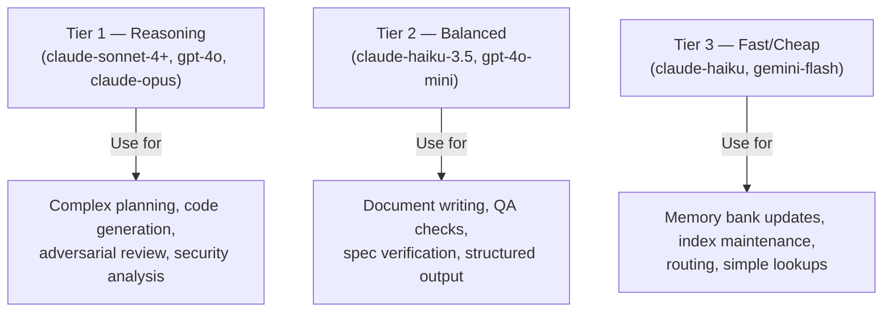
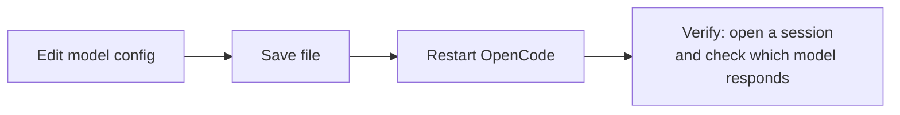

# Model Assignment Guide (Axiom)

Agents are not created equal. Some do complex multi-step reasoning. Some do fast lookups. Assigning the wrong model wastes money or breaks quality. This skill maps agents to the right model tier and produces a ready-to-apply config.

## When to Load

- During `/axiom-install` or `/axiom-onboarding` (always)
- After adding a new agent to `.opencode/agents/`
- When an agent is performing poorly (might need a stronger model)
- When costs are too high (might have powerful models on agents that don't need them)
- When the user asks "which model should I use for X?"

## Model Tiers



## Agent-to-Model Mapping

| Agent | Recommended Tier | Reasoning | Current Axiom default |
|---|---|---|---|
| `dispatch-axiom` | Tier 1 | Coordinates all work; needs full reasoning | claude-sonnet-4-6 |
| `tower-axiom` | Tier 1 | Primary orchestrator; complex multi-agent routing | claude-sonnet-4-6 |
| `dev-axiom` | Tier 1 | Writes production code; needs best output | claude-sonnet-4-6 |
| `pm-axiom` | Tier 1 | Plans and meta-plans; complex reasoning | claude-sonnet-4-6 |
| `specwriter-axiom` | Tier 1 | Writes contracts; precision matters | claude-sonnet-4-6 |
| `security-review-axiom` | Tier 1 | Adversarial; misses = vulnerabilities | claude-sonnet-4-6 |
| `redteam-axiom` | Tier 1 | Adversarial attack simulation | claude-sonnet-4-6 |
| `whitehat-axiom` | Tier 1 | Exploitability validation | claude-sonnet-4-6 |
| `qa-axiom` | Tier 1-2 | Test evaluation; can use balanced | claude-sonnet-4-6 |
| `spec-verifier-axiom` | Tier 1-2 | Spec alignment; needs accuracy | claude-sonnet-4-6 |
| `frontend-dev` | Tier 1 | UI generation + browser verification | claude-sonnet-4-6 |
| `db-architect-axiom` | Tier 1 | Schema design; mistakes are expensive | claude-sonnet-4-6 |
| `incident-commander-axiom` | Tier 1 | Real-time incident coordination | claude-sonnet-4-6 |
| `assumption-buster-axiom` | Tier 1-2 | Adversarial questioning | claude-sonnet-4-6 |
| `devils-advocate-axiom` | Tier 1-2 | Challenge and critique | claude-sonnet-4-6 |
| `ralph-wiggum-verify` | Tier 1-2 | Verification steering | claude-sonnet-4-6 |
| `docs-runbooks-axiom` | Tier 2 | Writing; no deep reasoning needed | claude-sonnet-4-6 |
| `sitrep-axiom` | Tier 2 | Structured reporting | claude-sonnet-4-6 |
| `best-practices-axiom` | Tier 2 | Pattern lookup and application | claude-sonnet-4-6 |
| `memory-bank-axiom` | **Tier 3** | File writes + index updates only | claude-haiku-4-5 |
| `prompt-mirror-axiom` | Tier 2 | Diff detection + file writes | claude-sonnet-4-6 |
| `trace-auditor-axiom` | Tier 2 | Trace link scanning | claude-sonnet-4-6 |

## How to Audit Current Assignments

### Step 1 — Read current config

```bash
cat opencode.jsonc | grep -A3 '"model"'
# or check each agent file:
grep "model:" .opencode/agents/*.md
```

### Step 2 — Compare to table above

For each agent, flag:
- **Overkill**: Tier 1 model on a Tier 3 task (waste money → downgrade)
- **Underpowered**: Tier 3 model on a Tier 1 task (hurts quality → upgrade)
- **Missing**: Agent has no model set (will inherit default)

### Step 3 — Check the global default

In `opencode.jsonc`, the top-level `model` field sets the default for all agents that don't override it:

```json
{
  "model": "amazon-bedrock/anthropic.claude-sonnet-4-6"
}
```

If the default is Tier 1, agents without explicit models use Tier 1. That's usually fine — but consider setting Tier 3 for `memory-bank-axiom` explicitly.

## Config Block to Apply

When the user wants to set models, produce a ready-to-paste config snippet:

```json
// In opencode.jsonc — global default:
{
  "model": "amazon-bedrock/anthropic.claude-sonnet-4-6"
}

// In .opencode/agents/memory-bank-axiom.md frontmatter:
// model: amazon-bedrock/anthropic.claude-haiku-4-5-20251001-v1:0
// (already set correctly in the default agent file)
```

Or for agent frontmatter:
```yaml
---
model: amazon-bedrock/anthropic.claude-sonnet-4-6  # Tier 1
# or
model: amazon-bedrock/anthropic.claude-haiku-4-5-20251001-v1:0  # Tier 3
---
```

## Model ID Reference (Amazon Bedrock)

| Tier | Model ID | Notes |
|---|---|---|
| Tier 1 | `amazon-bedrock/anthropic.claude-sonnet-4-6` | Best reasoning, highest cost |
| Tier 1 | `amazon-bedrock/anthropic.claude-opus-4-5` | Most powerful, use sparingly |
| Tier 3 | `amazon-bedrock/anthropic.claude-haiku-4-5-20251001-v1:0` | Fast, cheap, good for structured work |

For OpenAI-based deployments:
| Tier | Model ID |
|---|---|
| Tier 1 | `openai/gpt-4o` |
| Tier 2 | `openai/gpt-4o-mini` |

## After Making Changes

**You MUST restart OpenCode for model changes to take effect.**

Changes to:
- `opencode.jsonc` — restart required
- `.opencode/agents/*.md` frontmatter — restart required
- Skills (`.opencode/skills/`) — no restart needed (loaded at runtime)



**How to restart OpenCode:**
- If running via CLI: `Ctrl+C`, then relaunch
- If running in Coder workspace: exit and re-enter the session
- If running in Docker: `docker restart <container>`

## Common Issues

| Symptom | Likely cause | Fix |
|---|---|---|
| Agent gives shallow/wrong answers | Underpowered model | Upgrade to Tier 1 |
| Costs are very high | All agents on Tier 1 | Downgrade `memory-bank-axiom` and doc writers to Tier 3 |
| Agent ignores model field | Frontmatter syntax error | Check YAML indentation; model must be in `---` block |
| Changes have no effect | OpenCode not restarted | Restart OpenCode after config changes |
| Agent not found | Agent file doesn't exist in `.opencode/agents/` | Create the agent file |

## Memory Bank Capture

After auditing and updating model assignments:
- Record decisions in `.memory-bank/decisionLog.md`
- Note any cost/quality tradeoffs made
- **Preferred:** Call `@memory-bank-axiom`
