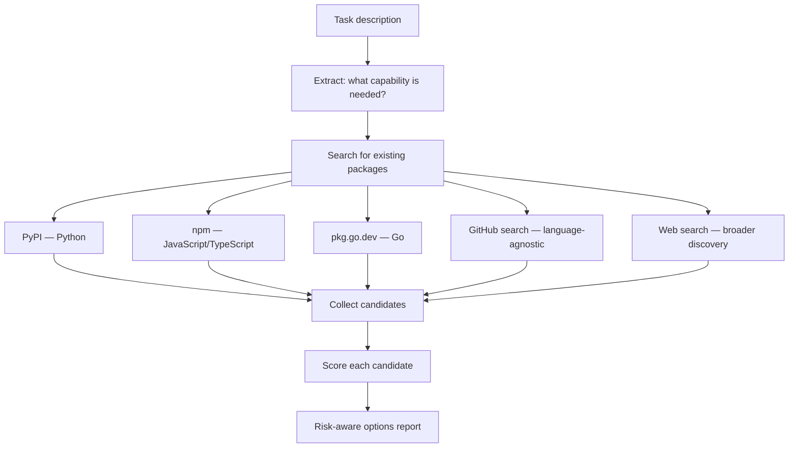
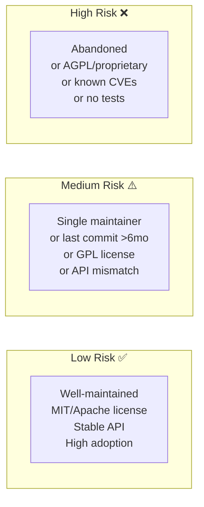

# OSS Package Finder (Axiom)

> **"The best code is code you didn't write."**
> **"The worst code is code you didn't write but pretended you didn't need to vet."**

This skill surfaces existing open-source options before committing to building custom. It is a **discovery aid** — not a mandate. The user decides whether to adopt, adapt, or build.

## When to Load

- During planning, when a work item involves building infrastructure that likely already exists as OSS
- When spec review reveals a component that seems overly foundational (HTTP clients, queues, parsers, ORMs, auth libraries)
- When an agent proposes "build a X from scratch" and X is a well-trodden problem space
- When the user explicitly says "is there something existing for this?"

## NOT When to Use

- For core business logic unique to the product
- When the team has explicitly decided to own a component for control/security reasons
- For glue code, adapters, and thin wrappers

## Search Strategy



### Step 1 — Extract the Capability

From the task description, identify the core capability being sought:
- NOT "build a Kafka consumer" → "message queue consumer with at-least-once delivery"
- NOT "write a JWT parser" → "stateless auth token validation"
- NOT "create a retry loop" → "HTTP client with exponential backoff and circuit breaker"

The abstracted capability is the search term.

### Step 2 — Search by Ecosystem

Use `webfetch` or `searxng` to find candidates:

```
# Python
https://pypi.org/search/?q=<capability>

# JavaScript/TypeScript
https://www.npmjs.com/search?q=<capability>

# Go
https://pkg.go.dev/search?q=<capability>

# GitHub (language-agnostic)
https://github.com/search?q=<capability>&type=repositories&sort=stars
```

Collect 3-5 strong candidates per capability. Do not surface everything — curate.

### Step 3 — Score Each Candidate

For each candidate, evaluate:

| Dimension | Weight | Signals |
|---|---|---|
| **Maintenance health** | High | Last commit < 6 months, active issues being closed, multiple maintainers |
| **Adoption** | High | Stars, download counts, used by recognizable projects |
| **License compatibility** | Critical | MIT/Apache-2.0 preferred; GPL requires review; AGPL often blocks commercial use |
| **API fit** | High | Does it match what we need without heavy wrapping? |
| **Dependency footprint** | Medium | Does it pull in a large dependency tree? |
| **Security posture** | High | Known CVEs? Active security disclosures? |
| **Breaking change history** | Medium | Does it have a stable major version with good SemVer discipline? |

### Step 4 — Assess Integration Risk



## Output Format

Produce a structured options report:

```markdown
## OSS Package Options: <capability>

**Capability sought:** <abstracted description>
**Language/ecosystem:** <Python | TypeScript | Go | ...>
**Search date:** <YYYY-MM-DD>

---

### Option 1: <package-name> ⭐ RECOMMENDED

- **Repo:** <url>
- **License:** MIT
- **Last commit:** 2 weeks ago
- **Stars:** 12,400
- **Weekly downloads:** 890,000
- **What it does:** <1-2 sentences>
- **Fit assessment:** Strong match — API aligns with what we need
- **Integration risk:** LOW
- **What you'd need to write:** Only a thin adapter layer (~50 lines)
- **Watch out for:** Requires Python 3.10+; no async support in v1 (v2 adds it)

---

### Option 2: <package-name>

- **Repo:** <url>
- **License:** Apache-2.0
- **Last commit:** 8 months ago  
- **Stars:** 3,200
- **What it does:** <1-2 sentences>
- **Fit assessment:** Partial match — covers 70% of the use case
- **Integration risk:** MEDIUM (single maintainer, stale activity)
- **What you'd need to write:** More wrapping needed; error handling is incomplete
- **Watch out for:** No type hints; poor documentation

---

### Option 3: Build from scratch

- **Effort:** ~200 lines
- **Why you might choose this:** None of the above fit; tight control needed; no deps wanted
- **Risk:** You own maintenance forever
- **Recommendation:** Only if Options 1-2 are blocked by license or API mismatch

---

## Recommendation

> Option 1 (`<package-name>`) is the best fit. It is actively maintained, MIT-licensed, and
> covers the use case with minimal wrapping. Suggest evaluating a spike before committing.
>
> **License compatibility confirmed for commercial use:** YES / NO / REVIEW NEEDED

## Risk Acceptance

If adopting any option, record this in the work item plan:
- The package chosen and version pinned
- License review outcome (see license field above)
- The adapter/wrapper scope
- Owner: who monitors this dependency for CVEs and updates?
```

## Risk Warnings to Always Surface

Regardless of the package's apparent quality, always surface these risks when relevant:

| Risk | When it applies | Severity |
|---|---|---|
| **GPL copyleft** | Any GPL-licensed package in commercial software | HIGH — requires legal review |
| **AGPL copyleft** | AGPL in any SaaS or server-side product | CRITICAL — often incompatible with commercial use |
| **Single maintainer** | Only one person owns the repo | MEDIUM — bus factor 1 |
| **Abandoned** | Last commit > 1 year, no response to issues | HIGH — you become the de facto maintainer |
| **Known CVEs** | Search NVD/GitHub Security Advisories | CRITICAL — assess before adopting |
| **No tests** | Repo has no visible test suite | MEDIUM — harder to trust correctness |
| **Version lock-in** | Package has no SemVer stability or frequent breaking changes | MEDIUM — upgrade cost is ongoing |

## What This Skill Does NOT Do

- Does not make the decision to adopt — that's the user's choice
- Does not perform a full security audit — flag CVE risk, but thorough audit needs `security-review-axiom`
- Does not evaluate proprietary or commercial alternatives
- Does not verify license compatibility with your specific legal situation — flag it, but get legal review for GPL/AGPL

## Memory Bank Capture

After producing an options report:
- Save the report to `.memory-bank/topics/oss-options/<capability-slug>.md` for future reference
- If the team adopts a package, note it in `.memory-bank/decisionLog.md`
- **Preferred:** Call `@memory-bank-axiom` to index it

## References

- `dependency-bot-axiom` agent — tracks and updates dependencies after adoption
- `security-review-axiom` skill — deeper security assessment of adopted packages
- `version-pinning-axiom` skill — how to pin and manage adopted package versions
