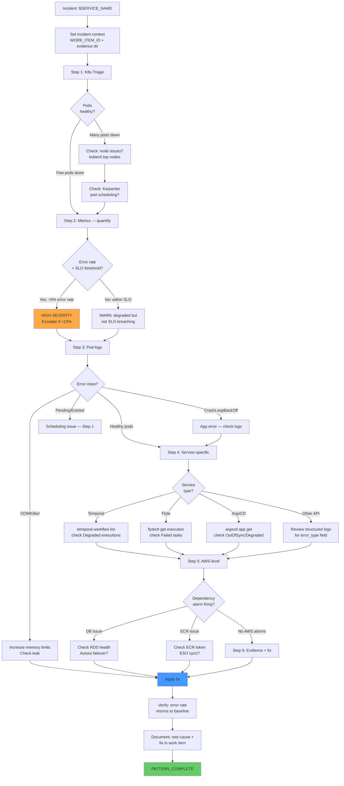

# Pattern: DevOps Incident Investigation (ShellOps)

Structured investigation for production incidents on the Dexdat platform.
This pattern moves from **broad signals → narrow cause → evidence → remediation**
using a deterministic funnel across the full observability stack.

**Rule**: Never skip a step to "save time." Each step constrains the hypothesis
space for the next one. Jumping to remediation without evidence produces wrong fixes.

<!-- axiom:trace work_item=devops-skills-01 prompt=.opencode/skills/pattern-devops-incident-shellops/SKILL.md -->

---

## Prerequisites

| Requirement | How to Verify | Expected | If Missing |
|---|---|---|---|
| `kubectl` context | `kubectl config current-context` | Affected cluster | `aws eks update-kubeconfig --name $CLUSTER_NAME` |
| `aws` CLI authenticated | `aws sts get-caller-identity` | Account + ARN | `aws sso login` |
| `argocd` CLI | `argocd app list` | Returns app list | `argocd login argocd.${CLUSTER_NAME}.dexdat.ai` |
| Grafana access | `curl -sf https://grafana.${CLUSTER_NAME}.dexdat.ai/api/health` | `{"database":"ok"}` | VPN + browser access |
| `jq` installed | `command -v jq` | Path returned | `brew install jq` |

**Incident context**:
```bash
export SERVICE_NAME="<affected-service>"   # e.g. orchestrator, flyte-propeller, temporal
export NAMESPACE="${SERVICE_NAME}"          # or the known namespace
export CLUSTER_NAME="${CLUSTER_NAME:-houston}"
export INCIDENT_START="${INCIDENT_START:-$(date -u -v-30M +%Y-%m-%dT%H:%M:%SZ)}"  # or known start time
export WORK_ITEM_ID="incident-$(date +%Y%m%dT%H%M%S)"
export EVIDENCE_DIR=".memory-bank/work-items/${WORK_ITEM_ID}"
mkdir -p "$EVIDENCE_DIR"
echo "Incident: $SERVICE_NAME on $CLUSTER_NAME since $INCIDENT_START" | tee "$EVIDENCE_DIR/summary.txt"
```

---

## Tool Chain

| Step | Name | Tools | Signal Type | Key Question | On Finding |
|---|---|---|---|---|---|
| 1 | Triage: scope + severity | `kubectl get events`, `kubectl top nodes` | K8s events, resource utilization | How many pods affected? Is the cluster healthy? | Set scope; decide escalation |
| 2 | Metrics: quantify impact | PromQL via `kubectl port-forward` or Grafana | Request rate, error rate, latency | What % of requests are failing? | Compare to SLO threshold |
| 3 | Pod-level diagnosis | `kubectl describe pod`, `kubectl logs` | Container events, stderr/stdout | What error is the container emitting? | Identify error class |
| 4 | Service-specific triage | Temporal CLI / `argocd app get` / Flyte console | Workflow state, sync status | Is the failure in the app layer or platform layer? | Route to app-level or infra fix |
| 5 | AWS-level check | `aws cloudwatch describe-alarms`, `aws rds describe-db-instances` | CloudWatch alarms, RDS health | Is a dependency (DB, SQS, ECR) causing the failure? | Fix dependency or fail over |
| 6 | Evidence + remediation | All tools | Captured evidence | Root cause confirmed? | Apply fix; verify; document |

---

## Flow Diagram



---

## Pseudocode

```text
PATTERN investigate_incident(service_name, namespace, cluster_name, incident_start):

  // ─── Step 1: K8s Triage ───
  kubectl get events -n $namespace --sort-by='.lastTimestamp' \
    | tail -30 > $EVIDENCE_DIR/k8s-events.txt

  kubectl get pods -n $namespace --output wide \
    > $EVIDENCE_DIR/pod-status.txt
  POD_ISSUES = grep -E "Error|CrashLoop|OOMKilled|Evicted|Pending" $EVIDENCE_DIR/pod-status.txt

  kubectl top nodes > $EVIDENCE_DIR/node-utilization.txt
  kubectl top pods -n $namespace --sort-by=memory >> $EVIDENCE_DIR/node-utilization.txt

  IF node CPU > 80% OR memory > 85%:
    // Node pressure — Karpenter should be scaling
    kubectl logs -n kube-system -l app.kubernetes.io/name=karpenter --tail=50 \
      | grep -E "provisioned|launched|ERROR" > $EVIDENCE_DIR/karpenter-logs.txt

  // ─── Step 2: Quantify with PromQL ───
  // Port-forward Prometheus or query AMP directly
  START_TS = $(date -d "$incident_start" +%s)
  END_TS = $(date +%s)

  ERROR_RATE_QUERY = 'sum(rate(http_requests_total{namespace="$namespace",status=~"5.."}[5m])) / sum(rate(http_requests_total{namespace="$namespace"}[5m]))'
  // Execute via Grafana API or prometheus query endpoint
  curl -s "http://prometheus.monitoring.svc.cluster.local:9090/api/v1/query?query=${ERROR_RATE_QUERY}" \
    > $EVIDENCE_DIR/error-rate.json

  LATENCY_QUERY = 'histogram_quantile(0.95, rate(http_request_duration_seconds_bucket{namespace="$namespace"}[5m]))'
  curl -s "http://prometheus.monitoring.svc.cluster.local:9090/api/v1/query?query=${LATENCY_QUERY}" \
    > $EVIDENCE_DIR/latency-p95.json

  // Compare to SLO threshold
  IF error_rate > 0.15: SEVERITY = CRITICAL — escalate
  ELIF error_rate > 0.05: SEVERITY = HIGH
  ELIF latency_p95 > 2s: SEVERITY = HIGH
  ELSE: SEVERITY = WARN

  // ─── Step 3: Pod-level logs ───
  // Get the most recently restarted pod
  FAILING_POD = kubectl get pods -n $namespace \
    --sort-by='.status.containerStatuses[0].restartCount' \
    -o jsonpath='{.items[-1].metadata.name}'

  kubectl logs $FAILING_POD -n $namespace --previous \
    | tail -100 > $EVIDENCE_DIR/pod-logs-previous.txt
  kubectl describe pod $FAILING_POD -n $namespace \
    > $EVIDENCE_DIR/pod-describe.txt

  // Extract error class from logs
  ERROR_CLASS = grep -E "ERROR|FATAL|panic|OOM|timeout|connection refused" \
    $EVIDENCE_DIR/pod-logs-previous.txt | head -5

  // ─── Step 4: Service-specific ───
  IF service_name contains "temporal":
    temporal workflow list \
      --namespace production \
      --query 'ExecutionStatus="Failed"' \
      --limit 10 --output json > $EVIDENCE_DIR/temporal-failed-workflows.json

  IF service_name contains "flyte" OR "propeller":
    flytectl get execution \
      --project default --domain production \
      --filter.field-selector 'phase=FAILED' \
      --limit 10 > $EVIDENCE_DIR/flyte-failed-executions.json

  IF "ArgoCD" or namespace sync issue:
    argocd app get $service_name --output json \
      > $EVIDENCE_DIR/argocd-app-state.json

  // ─── Step 5: AWS checks ───
  // Check CloudWatch alarms in ALARM state
  aws cloudwatch describe-alarms \
    --state-value ALARM \
    --alarm-name-prefix "<YOUR_ORG>" \
    --output json > $EVIDENCE_DIR/cloudwatch-alarms.json

  // Check RDS cluster health
  aws rds describe-db-clusters \
    --query 'DBClusters[?Status!=`available`]' \
    --output json > $EVIDENCE_DIR/rds-unhealthy.json

  // Check ECR token secret sync
  kubectl get externalsecret ecr-registry-credentials \
    -n $namespace -o jsonpath='{.status.conditions[0]}' \
    > $EVIDENCE_DIR/ecr-token-status.json

  // ─── Step 6: Synthesize + remediate ───
  ROOT_CAUSE = SYNTHESIZE(events, error_class, cloudwatch_alarms, rds_health)
  WRITE root cause + evidence paths to $EVIDENCE_DIR/root-cause.md

  // Apply remediation based on root cause
  REMEDIATE(root_cause)

  // Verify fix
  WAIT 2m
  ERROR_RATE_POST = rerun error rate PromQL
  IF error_rate_post < 0.01: REMEDIATION_VERIFIED = true
  ELSE: ESCALATE "Error rate not recovering after remediation"

  RETURN {
    status: PATTERN_COMPLETE,
    severity: SEVERITY,
    root_cause: ROOT_CAUSE,
    remediated: REMEDIATION_VERIFIED,
    evidence_dir: $EVIDENCE_DIR
  }
```

---

## Data Table

| Data Item | Created At | Used At | Persistence |
|---|---|---|---|
| `k8s-events.txt` | Step 1 | Step 3 context | `$EVIDENCE_DIR/k8s-events.txt` |
| `pod-status.txt` | Step 1 | Step 3 pod selection | `$EVIDENCE_DIR/pod-status.txt` |
| `node-utilization.txt` | Step 1 | Step 1 pressure check | `$EVIDENCE_DIR/node-utilization.txt` |
| `error-rate.json` | Step 2 | Step 2 severity + Step 6 verify | `$EVIDENCE_DIR/error-rate.json` |
| `latency-p95.json` | Step 2 | Step 2 severity | `$EVIDENCE_DIR/latency-p95.json` |
| `pod-logs-previous.txt` | Step 3 | Step 3 error class | `$EVIDENCE_DIR/pod-logs-previous.txt` |
| `cloudwatch-alarms.json` | Step 5 | Step 5 AWS check | `$EVIDENCE_DIR/cloudwatch-alarms.json` |
| `root-cause.md` | Step 6 | Post-incident review | `$EVIDENCE_DIR/root-cause.md` |

---

## On-Track / Off-Track Signals

| Signal | After Step | Indicator | Response |
|---|---|---|---|
| SIG-01 ✅ | 1 | Events collected; pod states captured | Continue to metrics |
| SIG-02 ❌ | 1 | `kubectl get pods` returns no output | Check namespace; check kubeconfig |
| SIG-03 ✅ | 2 | Error rate query returns numeric value | Continue with severity |
| SIG-04 ⚠️ | 2 | Error rate query returns "No data" | Prometheus may not be scraping — use Step 3 logs only |
| SIG-05 ✅ | 3 | Log lines show a clear error pattern | Root cause narrowed |
| SIG-06 ❌ | 3 | Logs empty or pod logs normal | Error may be upstream; check Step 4/5 |
| SIG-07 ✅ | 5 | All CloudWatch alarms OK | AWS deps healthy; focus on app layer |
| SIG-08 ❌ | 5 | RDS cluster status ≠ `available` | DB failover — check Aurora events; notify DBA |
| SIG-09 ✅ | 6 | Post-remediation error rate < 1% | PATTERN_COMPLETE |
| SIG-10 ❌ | 6 | Error rate persists after fix | Escalate; widen investigation scope |

---

## Common Root Cause → Remediation Map

| Root Cause | Evidence Signal | Remediation |
|---|---|---|
| OOMKilled | `pod-describe.txt`: `OOMKilled`, `Exit Code 137` | `kubectl set resources deployment $svc --limits=memory=2Gi`; check for leak |
| DB connection exhausted | Logs: `too many connections`; RDS: `DatabaseConnections` metric high | Reduce DB pool size; check idle connections; restart app pods |
| ECR token expired | `ecr-token-status.json`: `SecretSyncedError` | `kubectl annotate externalsecret ecr-registry-credentials force-sync=$(date +%s)` |
| Temporal worker not polling | `temporal-failed-workflows.json`: queue depth growing | Restart Temporal worker deployment |
| Flyte propeller crash | `flyte-failed-executions.json`: consistent failures | Check propeller logs; restart propeller pod |
| ArgoCD sync drift | `argocd-app-state.json`: `OutOfSync` | `argocd app sync $svc --prune` |
| Node pressure (Karpenter) | `karpenter-logs.txt`: no new nodes launching | Check NodePool limits; check EC2 capacity in AZ |
| Config error after deploy | K8s events: `CreateContainerConfigError` | Check ConfigMap/Secret existence; check ESO sync |

---

## When NOT to Use This Pattern

- **Non-production environment** — skip Steps 2 (SLO doesn't apply) and 5 (no alarms); go straight to pod logs
- **Known deployment regression** — use `helm rollback` immediately; investigation can be post-hoc
- **Platform-wide outage (EKS control plane)** — contact AWS support; skip to Step 5 AWS checks
- **Data corruption suspected** — STOP all writes immediately; escalate to data team before any investigation steps

---

## axiom:trace

`axiom:trace work_item=devops-skills-01 spec=specs/00-PRD.md prompt=.opencode/skills/pattern-devops-incident-shellops/SKILL.md ops=.axiom/runbooks/`
