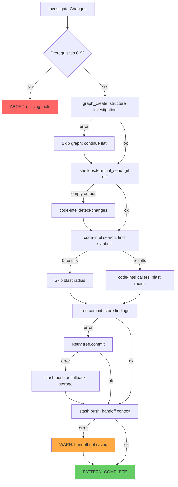

# Pattern: Investigate Changes

Analyze recent code changes to understand what happened, who's affected, and whether it's risky. This is the "post-flight inspection" pattern — after code lands, you run this to confirm nothing unexpected slipped through.

**Spec**: `specs/121-Pattern-Generator.md`
**Observed from**: 2 real executions on 2026-05-18 (HEAD~5..HEAD, HEAD~10..HEAD~5)

<!-- axiom:trace work_item=pattern-generator-01 spec=specs/121-Pattern-Generator.md -->

---

## Prerequisites

| Requirement | How to Verify | Expected | If Missing |
|-------------|---------------|----------|------------|
| ShellOps daemon running | `curl http://127.0.0.1:9876/health` | `{"status":"ok"}` | Start: `(_tmp/shellops-bin start --port 9876 --root . &)` |
| Code-intel binary exists | `_tmp/axiom-code-intel search --repo . --query "main"` | Returns JSON with `results` array | Build: `cd code-intel && $GO build -o ../_tmp/axiom-code-intel ./cmd/axiom-code-intel/` |
| Tree Memory initialized | Call `tree.status` | `initialized: true` | Call `tree.init` first |
| Graph Harness available | Call `graph_status` (no args) | Returns `recent_graphs` array | Check `.graph-harness/harness.db` exists |
| Context Stash available | Call `stash.list` | Returns `count` field | Plugin auto-initializes; check `.memory-bank/stash/` |
| Git repo accessible | `git log --oneline -1` | Returns a commit | Pattern requires a git repository |

---

## Tool Chain

| Step | Purpose | Tool | Key Input | Key Output | On Failure | Criticality | Timing |
|------|---------|------|-----------|------------|------------|-------------|--------|
| 0 | Verify prerequisites | (all above) | — | all pass | ABORT | Required | <2s |
| 1 | Structure investigation | `graph_create` | `{name, nodes[5]}` | `{graph_id, node_count: 5}` | Skip; proceed without structure | Optional | <1s |
| 2 | Gather changed files | `shellops.terminal_send` | `{command: "git diff --stat <range>"}` | `{output: "file | +/- lines\n..."}` | Fall back to `code-intel changes` | Required | <2s |
| 3 | Find affected symbols | `code-intel query --index` | `{--index <path>, --symbol "<name>"}` | `{matches: [{name, path, line, language}]}` | Proceed with file-level only | Optional | <1s |
| 4 | Assess blast radius | `code-intel callers` | `{--repo ., --symbol "<qualified_name>"}` | `{results: [{node: {...}}]}` | Note "blast radius unknown" | Enriching | <5s |
| 5 | Store findings | `tree.commit` | `{file, content, message}` | `{status: "committed"}` | Retry once → fall back to stash | Required | <1s |
| 6 | Handoff context | `stash.push` | `{summary, tags: "a,b,c"}` | `{stash_id: "..."}` | Warn; investigation still stored in tree | Optional | <1s |

---

## Flow Diagram



---

## Data Table

| Data Item | Created At | Used At | Type | Persistence |
|-----------|-----------|---------|------|-------------|
| `graph_id` | Step 1 | Step 6 (in summary) | `string \| null` | Graph Harness SQLite (durable) |
| `terminal_session_id` | Step 2 (create) | Step 2 (send), cleanup | `string` | Session only |
| `changed_files` | Step 2 (parsed) | Steps 3, 5 | `string[]` | Written to tree in Step 5 |
| `symbols` | Step 3 | Steps 4, 5 | `{name, file, line}[]` | Written to tree in Step 5 |
| `blast_radius` | Step 4 | Step 5 | `number` (caller count) | Written to tree in Step 5 |
| `finding` | Step 5 (composed) | Step 5, 6 | `object` | Tree Memory (durable) |
| `stash_id` | Step 6 | Return value | `string \| null` | Context Stash (session-scoped) |
| `risk_level` | Step 5 (assessed) | Step 6 (in summary) | `"LOW" \| "MEDIUM" \| "HIGH"` | Written to tree in Step 5 |

---

## Pseudocode

```text
PATTERN investigate_changes(commit_range, work_item_id?):

  // ─── Step 0: Prerequisites ───
  VERIFY shellops via GET http://127.0.0.1:9876/health → status == "ok"
  VERIFY code-intel via search("main") → results array exists
  VERIFY tree.status → initialized == true
  IF any required VERIFY fails:
    RETURN { status: "PATTERN_ABORTED", reason: "Prerequisites: " + failures }

  // ─── Step 1: Structure investigation (optional) ───
  graph_result = CALL graph_create({
    name: "investigate-" + commit_range,
    nodes: [
      { id: "gather", title: "Gather changes", type: "task" },
      { id: "symbols", title: "Find symbols", type: "task", depends_on: ["gather"] },
      { id: "blast", title: "Blast radius", type: "task", depends_on: ["symbols"] },
      { id: "store", title: "Store findings", type: "task", depends_on: ["blast"] },
      { id: "handoff", title: "Handoff", type: "task", depends_on: ["store"] }
    ]
  })
  graph_id = graph_result.graph_id OR null  // don't fail if graph unavailable

  // ─── Step 2: Gather changed files (required) ───
  terminal = CALL shellops.terminal_create({ name: "investigation" })
  diff_output = CALL shellops.terminal_send({
    session_id: terminal.session_id,
    command: "git diff --stat " + commit_range
  })
  IF diff_output.output is empty:
    diff_output = CALL code-intel({ operation: "changes", base: commit_range.start })
  changed_files = PARSE file paths from diff_output.output
  IF changed_files is empty:
    RETURN { status: "PATTERN_COMPLETE", risk: "NONE", reason: "No changes in range" }

  // ─── Step 3: Find affected symbols (optional) ───
  // IMPORTANT: Use "query --index" not "search --repo" — search rebuilds the graph and hangs.
  // Pre-built index at _tmp/code-intel.idx is instant.
  symbols = []
  FOR EACH file IN changed_files WHERE file matches *.go OR *.ts OR *.py:
    result = CALL code-intel query({ index: "_tmp/code-intel.idx", symbol: function_from(file) })
    IF result.matches.length > 0:
      symbols.push(result.matches[0])
  
  // ─── Step 4: Blast radius (enriching) ───
  blast_radius = 0
  IF symbols.length > 0:
    callers = CALL code-intel callers({ symbol: symbols[0].qualified_name })
    blast_radius = callers.results.length

  // ─── Step 5: Store findings (required) ───
  risk = ASSESS_RISK(changed_files, symbols, blast_radius)
    // LOW: all additive, 0 callers affected, no public API changes
    // MEDIUM: modifies existing behavior, some callers affected
    // HIGH: breaking changes, many callers, security-relevant files
  
  finding = {
    id: "INV-" + timestamp(),
    commit_range: commit_range,
    changed_files: changed_files,
    symbols_found: symbols.length,
    blast_radius: blast_radius,
    risk: risk,
    graph_id: graph_id,
    timestamp: now()
  }
  
  commit_result = CALL tree.commit({
    file: "findings/investigate-" + date() + ".json",
    content: JSON.stringify(finding),
    message: "Investigation: " + commit_range + " [" + risk + " risk]"
  })
  IF commit_result.error:
    commit_result = RETRY tree.commit (same args, once)
  IF commit_result.error:
    CALL stash.push({ summary: JSON.stringify(finding), tags: "investigation,fallback" })

  // ─── Step 6: Handoff context (optional) ───
  stash_result = CALL stash.push({
    summary: "Investigation of " + commit_range + ": " + risk + " risk. " +
             changed_files.length + " files, " + symbols.length + " symbols, " +
             "blast radius " + blast_radius + ". Graph: " + graph_id,
    tags: "investigation," + risk.toLowerCase()
  })
  stash_id = stash_result.stash_id OR null

  // ─── Cleanup ───
  CALL shellops.terminal_kill({ session_id: terminal.session_id })

  RETURN {
    status: "PATTERN_COMPLETE",
    graph_id: graph_id,
    finding_id: finding.id,
    stash_id: stash_id,
    risk: risk,
    changed_files: changed_files.length,
    symbols: symbols.length,
    blast_radius: blast_radius
  }
```

---

## On-Track / Off-Track Signals

| Signal ID | Type | After Step | Indicator | Response |
|-----------|------|-----------|-----------|----------|
| SIG-01 | on_track | 0 | All prerequisite health checks pass | Continue |
| SIG-02 | on_track | 1 | `graph_create` returns `graph_id` string | Continue |
| SIG-03 | off_track | 1 | `graph_create` returns `{error: ...}` | Skip graph; set graph_id = null |
| SIG-04 | on_track | 2 | `terminal_send` output contains `|` (diff stat format) | Continue |
| SIG-05 | off_track | 2 | `terminal_send` returns empty output | Fall back to code-intel changes |
| SIG-06 | on_track | 3 | `code-intel search` returns results.length > 0 | Continue to blast radius |
| SIG-07 | off_track | 3 | `code-intel search` returns 0 results | Skip blast radius; proceed to store |
| SIG-08 | on_track | 5 | `tree.commit` returns `status: "committed"` | Continue to handoff |
| SIG-09 | off_track | 5 | `tree.commit` returns error | Retry once; then fall back to stash |
| SIG-10 | on_track | 6 | `stash.push` returns `stash_id` string | PATTERN_COMPLETE |
| SIG-11 | off_track | 6 | `stash.push` returns `{error: "tags.split is not a function"}` | FIX: tags was array, change to string |
| SIG-12 | off_track | 6 | `stash.push` returns any other error | WARN; pattern still complete (findings in tree) |
| SIG-13 | abort | 0 | ShellOps daemon not reachable | ABORT: start daemon first |
| SIG-14 | abort | ANY | 3 consecutive required-step failures | ABORT: systematic failure |

---

## Adjustment Protocol

```text
IF off_track signal fires:

1. IDENTIFY: Which step? Which signal ID?

2. DIAGNOSE by signal:
   SIG-03 (graph error):     → Skip graph step; not critical
   SIG-05 (empty diff):      → Try code-intel changes; if still empty, range may be invalid
   SIG-07 (no symbols):      → Normal for doc-only or config changes; proceed without blast radius
   SIG-09 (tree.commit fail):→ Check tree.status; if not initialized, call tree.init then retry
   SIG-11 (tags type error): → Change tags from ["a","b"] to "a,b" (string not array)
   SIG-12 (stash error):     → Non-critical; findings already in tree; log warning and complete

3. COMMON FIXES:
   | Error Shape | Cause | Fix |
   |-------------|-------|-----|
   | `code-intel search` hangs (>10s) | `search --repo .` rebuilds full call graph | Use `query --index _tmp/code-intel.idx` (pre-built, instant) |
   | `tags.split is not a function` | tags passed as array | Use comma-separated string: "a,b,c" |
   | `Unknown action: undefined` | tree.branch missing action | Add action: "create" or "list" |
   | `undefined is not an object` | file/content param is undefined | Check variable is set before calling |
   | `watch "name" not found` | Used name instead of watch_id | Use watch_id from create response |
   | `graph_id is required` | graph_status called without ID | Pass graph_id from graph_create |

4. RETRY (max 2 per step):
   → If fixed and works: continue pattern
   → If still fails on Optional step: skip step, note degradation
   → If still fails on Required step: ABORT

5. REPORT on abort:
   → Return partial results (what DID work)
   → Include: last successful step, failed step, error, suggested fix
```

---

## Example Execution Trace (Observation #1: HEAD~5..HEAD)

```
─── Pattern Instance: investigate-changes ───
Input: { commit_range: "HEAD~5..HEAD", work_item_id: "plugin-bug-sweep-01" }

[Step 0] Prerequisites
  → curl http://127.0.0.1:9876/health
  ← {"status":"ok"}
  → code-intel search --query "main"
  ← { results: [...] }  (file_count: 847)
  → tree.status
  ← { initialized: true, branches: 2, current_branch: "qa-agent-sweep" }
  ✓ SIG-01: all pass

[Step 1] graph_create
  → graph_create({ name: "investigate-HEAD~5..HEAD", nodes: [5 nodes] })
  ← { graph_id: "gh_mpaqn23t_dom39b", node_count: 5, status: "created" }
  ✓ SIG-02: graph_id present

[Step 2] shellops.terminal_send
  → terminal_create({ name: "investigation" })
  ← { session_id: "shellops-session-60cf3f10" }
  → terminal_send({ session_id: "...", command: "git diff --stat HEAD~5..HEAD" })
  ← { output: " shellops/internal/daemon/daemon.go | 19 +-\n shellops/internal/daemon/daemon_test.go | 29 +-\n ... 8 files changed, 373 insertions(+), 25 deletions(-)" }
  ✓ SIG-04: output contains "|"

[Step 3] code-intel search
  → code-intel search({ query: "shutdownWatches" })
  ← { results: [{ node: { qualified_name: "daemon.(Daemon).shutdownWatches", file: "shellops/internal/daemon/daemon.go", line: 1029, confidence: "high" } }] }
  ✓ SIG-06: results.length = 1

[Step 4] code-intel callers
  → code-intel callers({ symbol: "daemon.(Daemon).shutdownWatches" })
  ← { results: [] }
  ✓ ON TRACK: 0 callers = new method, low blast radius

[Step 5] tree.commit
  → tree.commit({ file: "findings/investigate-recent-changes.json", content: "{...}", message: "Investigation: HEAD~5..HEAD" })
  ← { status: "committed", file: "findings/investigate-recent-changes.json", branch: "qa-agent-sweep" }
  ✓ SIG-08: status == "committed"

[Step 6] stash.push (FIRST ATTEMPT — FAILED)
  → stash.push({ summary: "...", tags: ["investigation", "low-risk"] })
  ← { error: "tags.split is not a function" }
  ✗ SIG-11: tags type error — passed array instead of string

[Step 6] stash.push (RETRY with fix)
  → stash.push({ summary: "...", tags: "investigation,low-risk" })
  ← { stash_id: "investigate-recent-changes", name: "investigate-recent-changes", state: "suspended" }
  ✓ SIG-10: stash_id present

RESULT: PATTERN_COMPLETE
  graph_id: "gh_mpaqn23t_dom39b"
  finding_id: "INV-001"
  stash_id: "investigate-recent-changes"
  risk: LOW
  changed_files: 8
  symbols: 1
  blast_radius: 0
```

---

## Risk Assessment Logic

```text
FUNCTION ASSESS_RISK(changed_files, symbols, blast_radius):
  
  score = 0
  
  // File-level signals
  IF any file matches *_test.go OR *.test.ts:  score += 0  // test-only = safe
  IF any file matches *.md:                     score += 0  // docs = safe  
  IF any file matches **/daemon/** OR **/api/**:score += 2  // runtime paths
  IF any file matches **/auth/** OR **/security/**:score += 5  // security-critical
  
  // Symbol-level signals
  IF symbols.length == 0:                       score += 0  // no code symbols = config/docs
  IF blast_radius == 0:                         score += 0  // new code, nothing depends on it
  IF blast_radius > 0 AND blast_radius <= 5:    score += 3  // some dependents
  IF blast_radius > 5:                          score += 5  // many dependents
  
  // Change-level signals
  IF all changes are additive (insertions only): score += 0
  IF changes modify existing lines:             score += 2
  IF changes delete code:                       score += 1
  
  IF score <= 2:  RETURN "LOW"
  IF score <= 6:  RETURN "MEDIUM"
  RETURN "HIGH"
```

---

## When NOT to Use This Pattern

- **Single-file change**: Just read the file diff directly — no need for the full investigation flow
- **Known change you just made**: You already know what changed; use `tree.commit` directly to store evidence
- **Investigating runtime behavior**: Use `pattern-debug-failure` instead (this pattern is for code changes, not runtime issues)
- **Changes older than 50 commits**: Consider narrowing the range or using `git log --since` instead
