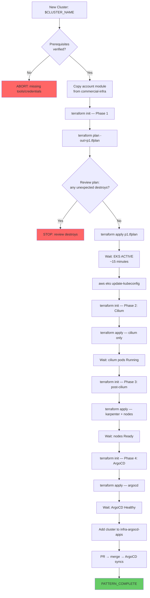

# Pattern: New EKS Cluster Provisioning (ShellOps)

Provision a new EKS cluster using the `commercial-infra` Terraform module pattern.
This is a **phased** workflow — each phase must complete before the next because
later phases depend on cluster resources created in earlier phases.

**Source**: `commercial-infra/` modules (console/lab/inference/portal accounts)
**Skills used**: terraform-shellops, aws-cli-shellops, kubernetes-shellops, argocd-shellops

<!-- axiom:trace work_item=devops-skills-01 prompt=.opencode/skills/pattern-new-cluster-shellops/SKILL.md -->

---

## Prerequisites

| Requirement | How to Verify | Expected | If Missing |
|---|---|---|---|
| AWS credentials + target account | `aws sts get-caller-identity` | Correct account ID | Switch profile/assume role |
| Terraform ≥ 1.5 | `terraform version` | `v1.5.x+` | `tfenv install 1.8.0` |
| `kubectl` installed | `kubectl version --client` | v1.28+ | Homebrew/apt |
| `helm` + ArgoCD CLI | `helm version && argocd version --client` | Both v3/v2+ | Homebrew/apt |
| `commercial-infra` repo cloned | `ls commercial-infra/modules/eks/` | `main.tf` | `gh repo clone <YOUR_ORG>/commercial-infra` |
| S3 backend bucket exists | `aws s3 ls s3://<YOUR_TF_STATE_BUCKET>` | Bucket exists | Create once: see terraform-shellops §State Management |
| DynamoDB lock table exists | `aws dynamodb describe-table --table-name terraform-state-lock` | Table active | Create once |

**Required env vars**:
```bash
export CLUSTER_NAME="my-new-cluster"
export ACCOUNT_TYPE="console"          # console | lab | inference | portal
export AWS_REGION="${AWS_REGION:-us-east-1}"
export TF_STATE_BUCKET="<YOUR_TF_STATE_BUCKET>"
export WORK_ITEM_ID="${WORK_ITEM_ID:-new-cluster-$(date +%Y%m%d)}"
export EVIDENCE_DIR=".memory-bank/work-items/${WORK_ITEM_ID}"
mkdir -p "$EVIDENCE_DIR"
```

---

## Tool Chain

| Phase | Name | Module | Key Resources Created | Wait For | On Failure |
|---|---|---|---|---|---|
| 1 | Network + EKS | `modules/vpc` + `modules/eks` | VPC, subnets, EKS control plane, KMS key, IAM roles | EKS cluster ACTIVE (~15 min) | Check IAM; check quota |
| 2 | Cilium CNI | `modules/cilium` | Helm release: cilium | All cilium pods Running | Re-apply; check OIDC provider |
| 3 | Post-Cilium | `modules/post-cilium` | Karpenter, node groups, GitHub OIDC, IAM roles | Node group nodes Ready | Check Karpenter logs |
| 4 | ArgoCD | `modules/argocd` | ArgoCD Helm release, cross-account deployer IAM role | ArgoCD pods Healthy | Fix values.tpl.yaml |
| 5 | Cluster registration | `infra-argocd-apps/clusters/` | Cluster entry in App of Apps | ArgoCD shows cluster | Fix cluster YAML |

---

## Flow Diagram



---

## Pseudocode

```text
PATTERN new_cluster(cluster_name, account_type, aws_region):

  // ─── Setup: Copy module structure ───
  ACCOUNT_DIR = commercial-infra/${account_type}/modules/
  IF $account_type is new:
    mkdir -p $ACCOUNT_DIR
    cp -r commercial-infra/modules/eks/ $ACCOUNT_DIR/eks/
    cp -r commercial-infra/modules/cilium/ $ACCOUNT_DIR/cilium/
    cp -r commercial-infra/modules/post-cilium/ $ACCOUNT_DIR/post-cilium/
  ELSE:
    // Account already has modules; add cluster to existing configs

  // ─── Phase 1: VPC + EKS ───
  cd commercial-infra
  terraform init -backend-config="key=${account_type}/${cluster_name}/phase1.tfstate"
  aws sts get-caller-identity --output json > $EVIDENCE_DIR/aws-identity.json

  terraform plan \
    -var="cluster_name=${cluster_name}" \
    -var="kubernetes_version=1.31" \
    -var="provisioner_role_arn=$(aws sts get-caller-identity --query Arn --output text)" \
    -out=p1.tfplan 2>&1 | tee $EVIDENCE_DIR/p1-plan.txt

  // GATE: Review plan — abort if unexpected destroys
  grep -E "will be destroyed|must be replaced" $EVIDENCE_DIR/p1-plan.txt
    IF found: STOP "Review destroys before applying"

  terraform apply p1.tfplan 2>&1 | tee $EVIDENCE_DIR/p1-apply.txt

  // Wait for cluster ACTIVE
  aws eks wait cluster-active --name $cluster_name --region $aws_region
  aws eks update-kubeconfig --name $cluster_name --region $aws_region
  kubectl get nodes  // Should show 0 Ready nodes (no workers yet — that's expected)

  // ─── Phase 2: Cilium CNI ───
  terraform init -backend-config="key=${account_type}/${cluster_name}/phase2-cilium.tfstate"
  terraform apply -target=helm_release.cilium \
    -var="cluster_name=${cluster_name}" \
    --auto-approve 2>&1 | tee $EVIDENCE_DIR/p2-apply.txt
  kubectl wait --for=condition=Ready pods -l k8s-app=cilium -n kube-system --timeout=300s

  // ─── Phase 3: Post-cilium (Karpenter + nodes) ───
  terraform init -backend-config="key=${account_type}/${cluster_name}/phase3-post-cilium.tfstate"
  terraform plan \
    -var="cluster_name=${cluster_name}" \
    -var="enable_karpenter=true" \
    -var="github_oidc_enabled=true" \
    -out=p3.tfplan 2>&1 | tee $EVIDENCE_DIR/p3-plan.txt
  terraform apply p3.tfplan 2>&1 | tee $EVIDENCE_DIR/p3-apply.txt

  // Karpenter will start nodes as soon as workloads need them
  kubectl get pods -n kube-system -l app.kubernetes.io/name=karpenter
    // Should show Running

  // ─── Phase 4: ArgoCD ───
  terraform init -backend-config="key=${account_type}/${cluster_name}/phase4-argocd.tfstate"
  terraform plan \
    -var="cluster_name=${cluster_name}" \
    -var="argocd_hub_account_id=<YOUR_HUB_ACCOUNT_ID>" \
    -out=p4.tfplan 2>&1 | tee $EVIDENCE_DIR/p4-plan.txt
  terraform apply p4.tfplan 2>&1 | tee $EVIDENCE_DIR/p4-apply.txt

  argocd app list  // Should show ArgoCD managing itself
  kubectl get pods -n argocd  // All pods Running

  // ─── Phase 5: Register cluster in infra-argocd-apps ───
  // Get cluster endpoint and CA cert
  CLUSTER_ENDPOINT=$(aws eks describe-cluster --name $cluster_name \
    --query cluster.endpoint --output text)
  OIDC_PROVIDER=$(aws eks describe-cluster --name $cluster_name \
    --query cluster.identity.oidc.issuer --output text | sed 's|https://||')

  // Add cluster config file
  Create infra-argocd-apps/clusters/${cluster_name}.yaml:
    cluster.name: $cluster_name
    cluster.awsAccount: $(aws sts get-caller-identity --query Account --output text)
    cluster.oidcProviderUrl: $OIDC_PROVIDER

  git commit -m "feat: add cluster ${cluster_name} to ArgoCD"
  git push → PR → merge → root-app syncs → cluster appears in ArgoCD

  RETURN {
    status: PATTERN_COMPLETE,
    cluster_name: cluster_name,
    endpoint: $CLUSTER_ENDPOINT,
    argocd_registered: true,
    evidence_dir: $EVIDENCE_DIR
  }
```

---

## Data Table

| Data Item | Created At | Used At | Persistence |
|---|---|---|---|
| `aws-identity.json` | Phase 1 setup | Audit trail | `$EVIDENCE_DIR/aws-identity.json` |
| `p1-plan.txt` | Phase 1 plan | Review gate | `$EVIDENCE_DIR/p1-plan.txt` |
| `p1-apply.txt` | Phase 1 apply | Evidence | `$EVIDENCE_DIR/p1-apply.txt` |
| `cluster_endpoint` | Phase 1 output | Phase 5 | Terraform output |
| `oidc_provider_url` | Phase 1 output | Phase 3, 5 | Terraform output |
| `karpenter_role_arn` | Phase 3 output | K8s NodeClass | Terraform output |
| `argocd_deployer_role_arn` | Phase 4 output | Hub ArgoCD | Terraform output |
| `cluster_${cluster_name}.yaml` | Phase 5 | infra-argocd-apps | Git-committed |

---

## On-Track / Off-Track Signals

| Signal | After Phase | Indicator | Response |
|---|---|---|---|
| SIG-01 ✅ | 1 | `aws eks describe-cluster` shows `status: ACTIVE` | Continue |
| SIG-02 ❌ | 1 | EKS stuck in CREATING >20 min | Check CloudFormation events; check service quotas |
| SIG-03 ✅ | 2 | `kubectl get pods -l k8s-app=cilium -n kube-system` all Running | Continue |
| SIG-04 ❌ | 2 | Cilium pods CrashLoopBackOff | Check OIDC provider; check VPC CNI removed |
| SIG-05 ✅ | 3 | Karpenter controller pod Running | Continue |
| SIG-06 ❌ | 3 | Karpenter pod Pending | Check IAM role; check SQS queue created |
| SIG-07 ✅ | 4 | All ArgoCD pods Running; `argocd app list` returns apps | Continue |
| SIG-08 ❌ | 4 | ArgoCD pod ImagePullBackOff | Check ECR token ExternalSecret on cluster |
| SIG-09 ✅ | 5 | Cluster appears in ArgoCD UI with no errors | PATTERN_COMPLETE |
| SIG-10 ❌ | 5 | Cluster shows connection error in ArgoCD | Check argocd_deployer IAM role trust policy |

---

## Timing Reference

| Phase | Typical Duration | What to Do While Waiting |
|---|---|---|
| Phase 1: EKS creation | 12-18 minutes | Review the plan output; prepare Phase 2 config |
| Phase 2: Cilium | 3-5 minutes | Watch `kubectl get pods -n kube-system -w` |
| Phase 3: Karpenter | 5-8 minutes | Watch `kubectl get pods -n kube-system -w` |
| Phase 4: ArgoCD | 4-6 minutes | Watch `kubectl get pods -n argocd -w` |
| Phase 5: Registration | 2-3 minutes | ArgoCD webhook triggers on git push |

---

## When NOT to Use This Pattern

- **Adding a workload to an existing cluster** — use `pattern-new-service-shellops`
- **Upgrading Kubernetes version** — use Terraform `aws_eks_cluster.version` update only, not a new cluster
- **Emergency patching** — apply `terraform apply -target=` for the specific resource, not full cluster re-provision
- **Lambda Labs GPU clusters** — different provisioning path; not via commercial-infra Terraform

---

## axiom:trace

`axiom:trace work_item=devops-skills-01 spec=specs/00-PRD.md prompt=.opencode/skills/pattern-new-cluster-shellops/SKILL.md`
