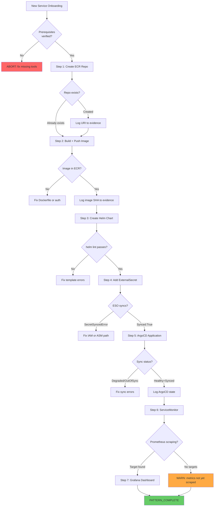

# Pattern: New Service Onboarding (ShellOps)

End-to-end workflow for bringing a new service from "container exists" to
"running in production with observability." This pattern orchestrates 7 tools/steps
in the correct dependency order — each step is a prerequisite for the next.

**Spec**: `infra-argocd-apps` + `infra-charts` conventions
**Skills used**: docker-shellops, helm-shellops, external-secrets-shellops, argocd-shellops, prometheus-shellops, grafana-shellops

<!-- axiom:trace work_item=devops-skills-01 prompt=.opencode/skills/pattern-new-service-shellops/SKILL.md -->

---

## Prerequisites

| Requirement | How to Verify | Expected | If Missing |
|---|---|---|---|
| AWS credentials | `aws sts get-caller-identity` | Returns account/ARN | Run `aws sso login` or set env vars |
| `kubectl` context set | `kubectl config current-context` | Your cluster name | `aws eks update-kubeconfig --name $CLUSTER_NAME` |
| `helm` installed | `helm version` | v3.x | `brew install helm` |
| `helm-diff` plugin | `helm plugin list \| grep diff` | `diff 3.x` | `helm plugin install https://github.com/databus23/helm-diff` |
| ArgoCD CLI | `argocd version --client` | v2.x | `brew install argocd` |
| `gh` CLI authenticated | `gh auth status` | Logged in | `gh auth login` |
| `infra-charts` repo cloned | `ls infra-charts/` | Chart directories | `gh repo clone <YOUR_ORG>/infra-charts` |
| `infra-argocd-apps` repo cloned | `ls infra-argocd-apps/templates/` | `.yaml` files | `gh repo clone <YOUR_ORG>/infra-argocd-apps` |

**Required env vars**:
```bash
export SERVICE_NAME="my-service"          # snake-case service name
export NAMESPACE="${SERVICE_NAME}"        # K8s namespace (usually same as service name)
export CLUSTER_NAME="houston"             # Target cluster
export AWS_ACCOUNT_ID=$(aws sts get-caller-identity --query Account --output text)
export AWS_REGION="${AWS_REGION:-us-east-1}"
export IMAGE_TAG="sha-$(git rev-parse --short HEAD)"
export WORK_ITEM_ID="${WORK_ITEM_ID:-new-service-$(date +%Y%m%d)}"
export EVIDENCE_DIR=".memory-bank/work-items/${WORK_ITEM_ID}"
mkdir -p "$EVIDENCE_DIR"
```

---

## Tool Chain

| Step | Name | Tool/Command | Key Input | Key Output | On Failure | Criticality |
|---|---|---|---|---|---|---|
| 1 | ECR repo | `aws ecr create-repository` | `$SERVICE_NAME` | Repository URI | Check if already exists | Required |
| 2 | Build + push image | `docker build` + `aws ecr get-login-password` | Dockerfile + tag | Image SHA in ECR | Fix Dockerfile; check ECR permissions | Required |
| 3 | Helm chart | `helm create` + edit | Chart template | `infra-charts/$SERVICE_NAME/` | Validate with `helm lint` | Required |
| 4 | ExternalSecret | Edit Helm chart templates | ASM secret path | `ExternalSecret` in chart | Check ESO is running; verify IAM | Required |
| 5 | ArgoCD Application | `kubectl apply` or Helm template in infra-argocd-apps | Chart path + values | ArgoCD syncs to cluster | Check ArgoCD logs; fix sync errors | Required |
| 6 | ServiceMonitor | Add to Helm chart | `/metrics` endpoint port | Prometheus scrapes service | Check ServiceMonitor selector | Recommended |
| 7 | Grafana dashboard | Add JSON to infra-charts/grafana | Golden signals PromQL | Dashboard visible in Grafana | Check label `grafana_dashboard: "1"` | Recommended |

---

## Flow Diagram



---

## Pseudocode

```text
PATTERN new_service(service_name, namespace, cluster_name, image_tag):

  // ─── Step 1: ECR repository ───
  ecr_uri = aws ecr describe-repositories --repository-names $service_name
    .catch(RepositoryNotFoundException):
      ecr_uri = aws ecr create-repository \
        --repository-name $service_name \
        --image-scanning-configuration scanOnPush=true \
        --output json | jq -r .repository.repositoryUri
  RECORD ecr_uri TO evidence/ecr-repo.json

  // ─── Step 2: Build and push ───
  aws ecr get-login-password --region $AWS_REGION \
    | docker login --username AWS --password-stdin ${AWS_ACCOUNT_ID}.dkr.ecr.${AWS_REGION}.amazonaws.com
  docker build --target runtime --tag ${ecr_uri}:${image_tag} .
  docker push ${ecr_uri}:${image_tag}
  VERIFY: aws ecr describe-images --repository-name $service_name --image-ids imageTag=$image_tag
  IF not found: FAIL "Image push failed"
  RECORD image digest TO evidence/image-push.json

  // ─── Step 3: Helm chart ───
  IF NOT exists infra-charts/$service_name/:
    helm create infra-charts/$service_name
    # Replace generated templates with canonical templates from infra-charts/example/
    cp infra-charts/example/templates/* infra-charts/$service_name/templates/
  Edit Chart.yaml: name=$service_name, version=0.1.0, appVersion=$image_tag
  Edit values.yaml: image.repository=$ecr_uri, image.tag=$image_tag
  helm lint infra-charts/$service_name -f infra-charts/$service_name/values-test.yaml
  IF lint fails: STOP and fix template errors

  // ─── Step 4: ExternalSecret ───
  # Create ASM secret first
  aws secretsmanager create-secret \
    --name "${service_name}/production" \
    --secret-string '{"placeholder": "replace-me"}' \
    IF already exists: skip
  Add infra-charts/$service_name/templates/externalsecret.yaml
    with secretStoreRef: aws-secrets-manager
    refreshInterval: 1h
  helm diff upgrade $service_name infra-charts/$service_name -n $namespace --install
  helm upgrade --install $service_name infra-charts/$service_name -n $namespace --create-namespace --wait
  kubectl get externalsecret -n $namespace   # verify SYNCED:True
  IF SecretSyncedError: check IAM policy; fix; force-sync

  // ─── Step 5: ArgoCD Application ───
  # Add Application template to infra-argocd-apps
  Create infra-argocd-apps/templates/$service_name.yaml:
    source.path: $service_name (in infra-charts)
    destination.namespace: $namespace
    syncPolicy.automated.prune: true
    syncPolicy.automated.selfHeal: true
  git commit -m "feat: add ArgoCD application for $service_name"
  git push → ArgoCD webhook triggers sync
  argocd app wait $service_name --sync --health --timeout 300
  RECORD argocd app state TO evidence/argocd-state.json

  // ─── Step 6: ServiceMonitor ───
  Add infra-charts/$service_name/templates/servicemonitor.yaml:
    port: metrics, interval: 30s, path: /metrics
  helm upgrade $service_name infra-charts/$service_name -n $namespace --wait
  # Wait 2 scrape intervals then verify
  WAIT 60s
  kubectl get servicemonitor $service_name -n monitoring
  // Prometheus scrape target should appear within 2 minutes

  // ─── Step 7: Grafana dashboard ───
  Add infra-charts/grafana/dashboards/${service_name}_dashboard.json
    (golden signals: request rate, error rate, p95 latency, saturation)
  Add infra-charts/grafana/templates/dashboards/${service_name}-dashboard.yaml
    with annotation grafana_folder: provisioned-services
  helm upgrade grafana infra-charts/grafana -n monitoring --wait
  // Dashboard should appear in Grafana within 30s

  RETURN {
    status: PATTERN_COMPLETE,
    ecr_uri: ecr_uri,
    image_tag: image_tag,
    namespace: namespace,
    argocd_app: service_name,
    evidence_dir: EVIDENCE_DIR
  }
```

---

## Data Table

| Data Item | Created At | Used At | Type | Persistence |
|---|---|---|---|---|
| `ecr_uri` | Step 1 | Steps 2, 3 | `string` | ECR + evidence JSON |
| `image_digest` | Step 2 | Step 5 (ArgoCD image tag) | `string` | evidence/image-push.json |
| `helm_release_name` | Step 3 | Steps 4, 5, 6, 7 | `string` | Helm state in cluster |
| `externalsecret_name` | Step 4 | Step 4 (verify) | `string` | K8s resource |
| `argocd_app_state` | Step 5 | evidence bundle | `object` | evidence/argocd-state.json |
| `servicemonitor_name` | Step 6 | Step 6 (verify) | `string` | K8s resource |
| `dashboard_uid` | Step 7 | Grafana | `string` | infra-charts/grafana/dashboards/ |

---

## On-Track / Off-Track Signals

| Signal | After Step | Indicator | Response |
|---|---|---|---|
| SIG-01 ✅ | 1 | `ecr_uri` contains `.dkr.ecr.` | Continue |
| SIG-02 ❌ | 2 | `docker push` returns non-zero | Check ECR auth; try `aws ecr get-login-password` again |
| SIG-03 ✅ | 2 | `aws ecr describe-images` returns image entry | Continue |
| SIG-04 ❌ | 3 | `helm lint` exits non-zero | Read template errors; fix YAML |
| SIG-05 ✅ | 4 | `kubectl get externalsecret` shows `SYNCED: True` | Continue |
| SIG-06 ❌ | 4 | `SYNCED: False REASON: SecretSyncedError` | Check IAM policy; check ASM path; force-sync |
| SIG-07 ✅ | 5 | `argocd app get` shows `Health: Healthy, Sync: Synced` | Continue |
| SIG-08 ❌ | 5 | `argocd app get` shows `Health: Degraded` | `kubectl get events -n $namespace`; fix manifest errors |
| SIG-09 ⚠️ | 6 | `kubectl get servicemonitor` not found after 2 min | Check selector labels; Prometheus namespace access |
| SIG-10 ✅ | 7 | Dashboard visible in Grafana within 30s | PATTERN_COMPLETE |

---

## Common Failure Modes

| Failure | Root Cause | Fix |
|---|---|---|
| `ECR: RepositoryNotFoundException` | Repo not created yet | Run Step 1 create-repository |
| `docker push: no basic auth` | ECR login expired | Re-run `aws ecr get-login-password \| docker login...` |
| `ExternalSecret: AccessDeniedException` | IAM policy missing `secretsmanager:GetSecretValue` | Add policy; annotate SA with role ARN |
| `ArgoCD: OutOfSync (ComparisonError)` | Invalid YAML in Helm template | `helm template $service_name infra-charts/$service_name` to find errors |
| `Pod: ImagePullBackOff` | ECR token expired on node | Check ECR token ExternalSecret `refreshInterval: 4h` |
| `ServiceMonitor: no targets` | Label selector mismatch | `kubectl get svc -n $namespace --show-labels`; match in ServiceMonitor |

---

## When NOT to Use This Pattern

- **Service already deployed** — use `helm upgrade` directly + verify ArgoCD sync
- **Stateful service (DB, queue)** — provision DB first via `infra-charts/postgres` or `infra-charts/temporal` before this pattern
- **Emergency hotfix** — use direct `helm upgrade` with skip-sync; fix ArgoCD config in follow-up
- **Multi-cluster rollout** — use ApplicationSet in ArgoCD to fan out across clusters instead

---

## axiom:trace

`axiom:trace work_item=devops-skills-01 spec=specs/00-PRD.md prompt=.opencode/skills/pattern-new-service-shellops/SKILL.md`
