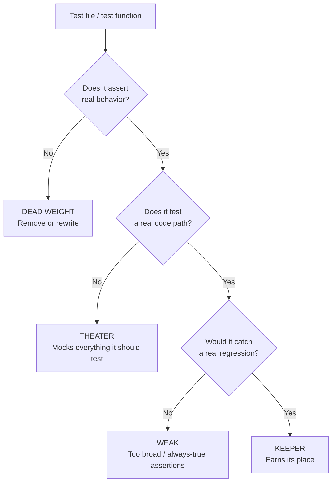
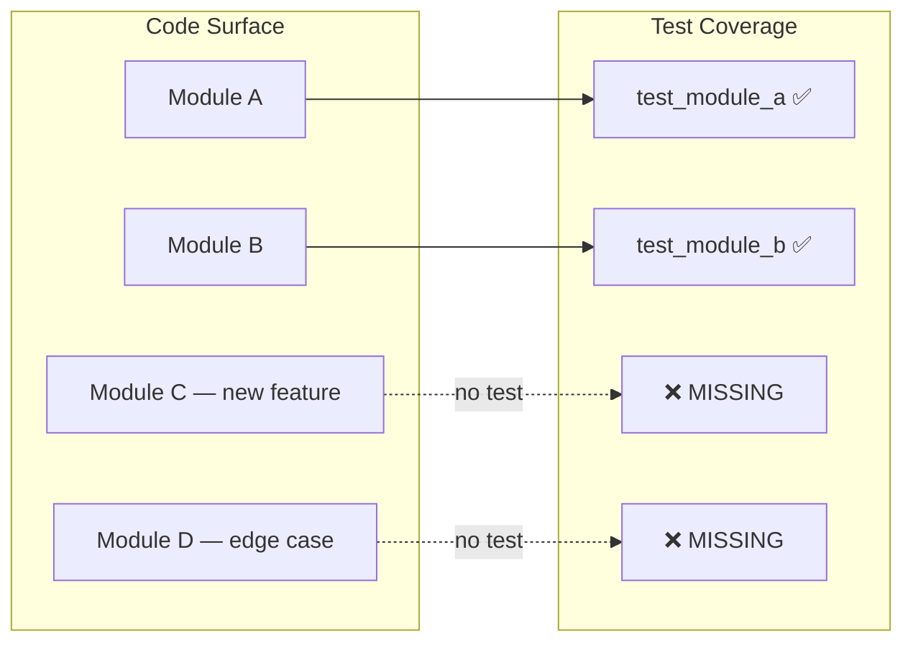

# Test Inspector (Axiom)

> **"A test suite with 90% coverage can still have zero valuable tests."**
> **"The most expensive test is the one you forgot to write."**

This skill inspects an existing test suite, assigns value to each test, flags dead weight, and maps the coverage holes where code exists but regression protection doesn't.

## When to Load

- During `/axiom-verify` Phase 1 (always — test quality is a first-class signal)
- When a PR adds new code but the test diff looks thin
- When a test suite has "green" coverage numbers but behavior feels fragile
- When onboarding to a new codebase (understand what's actually tested)
- After a bug is fixed — check if a regression test was added

## The Three Decisions Per Test

Every test gets classified into one of three buckets:



## Value Classification Table

| Class | Score | Criteria | Action |
|---|---|---|---|
| **KEEPER** | 70-100 | Asserts specific behavior, tests real code path, would catch a real bug | Keep — this is what good looks like |
| **WEAK** | 40-69 | Tests real code but assertions are too broad (e.g., `assert result is not None`) | Strengthen assertions or flag for rewrite |
| **THEATER** | 10-39 | Mocks everything it should be testing; passing proves nothing about the product | Flag — tests the mock, not the code |
| **DEAD WEIGHT** | 0-9 | No meaningful assertions, `assertTrue(True)`, tests only the test framework | Delete — negative value (false confidence) |

## How to Inspect a Test Suite

### Phase 1 — Inventory

```bash
# Find all test files
find . -name "test_*.py" -o -name "*_test.py" -o -name "*.test.ts" -o -name "*.spec.ts" | grep -v node_modules | sort

# Count test functions per file
grep -rn "def test_\|it(\|describe(\|func Test" --include="*.py" --include="*.ts" --include="*.go" . | wc -l
```

For each test file, record:
- File path
- Test function count
- Language / framework
- What module/feature it ostensibly covers

### Phase 2 — Classify Each Test

For each test function, evaluate:

**Dead Weight signals (score 0-9):**
- `assert True` or `assert 1 == 1`
- No assertions at all
- Only asserts that the function exists (`hasattr`, `isinstance` alone)
- Only asserts that calling the function doesn't raise (pass = "it ran")
- Source inspection (`inspect.getsource()` calls)

**Theater signals (score 10-39):**
- Every dependency is mocked with `MagicMock()` or `jest.fn()`
- The function under test is itself mocked
- Test creates a mock, calls mock, asserts mock was called
- Raw HTTP calls instead of real adapter (tests mock server not code)
- Database fixture that always matches (no failure path tested)

**Weak signals (score 40-69):**
- `assert result is not None` (only checks existence, not value)
- `assert len(result) > 0` (only checks non-empty, not content)
- `assert status_code == 200` (only checks happy path, no error paths)
- `assert isinstance(result, dict)` (only checks type, not content)
- Tests only the happy path with pre-seeded data designed to pass

**Keeper signals (score 70-100):**
- Specific value assertions: `assert result["count"] == 3`
- Tests both happy and error paths
- Uses real production code paths (not mocks of the thing being tested)
- Would catch the specific regression it was written for
- Tests a user-visible behavior, not an implementation detail

### Phase 3 — Find the Holes

Coverage holes are worse than weak tests — they're invisible. Map every feature/module against the test inventory:



**Hole-finding process:**

1. List all public functions/endpoints/behaviors in the changed code
2. For each one, ask: does a test exist that would catch a regression?
3. Flag any that answer "no" as a hole

**High-risk holes (must flag as HIGH or CRITICAL):**
- Error handling paths with no test (`except` blocks, `catch`, `if err != nil`)
- Data validation logic (what happens with invalid input?)
- Authentication/authorization paths
- Any code touched in this work item with no corresponding test change
- Functions that were modified but whose test wasn't updated

### Phase 4 — Produce the Graded Inventory

Output a test inventory with:

```markdown
## Test Inventory: <work_item_id> — <date>

### Summary
- Total tests scanned: N
- KEEPER: N (N%)
- WEAK: N (N%)  
- THEATER: N (N%)
- DEAD WEIGHT: N (N%)
- Coverage holes identified: N

### Graded Tests

| Test | File | Score | Class | Issue | Action |
|---|---|---|---|---|---|
| test_run_completed | test_orchestrator.py | 85 | KEEPER | — | Keep |
| test_run_exists | test_orchestrator.py | 12 | THEATER | Mocks orchestrator itself | Rewrite to call real orchestrator |
| test_true_is_true | test_utils.py | 0 | DEAD WEIGHT | No assertions | Delete |
| test_status_not_none | test_api.py | 35 | WEAK | Only checks not None | Assert specific status value |

### Coverage Holes

| Missing Test | Module | Risk Level | Why it matters |
|---|---|---|---|
| Error path: run fails with missing config | orchestrator.py:87 | HIGH | Failure mode has no regression guard |
| Invalid input to /api/v1/runs | routes.py:42 | HIGH | Validation logic untested |
| DB write after step completion | step_executor.py:120 | MEDIUM | Silent failure possible |
```

## Integration with /axiom-verify

When loaded during `/axiom-verify`:

1. Run the inventory against all test files touched by the work item
2. Any DEAD WEIGHT tests → MEDIUM finding (inject step to delete)
3. Any THEATER tests covering critical paths → HIGH finding (inject step to rewrite)
4. Any coverage holes on modified code → HIGH or CRITICAL finding (inject step to add test)
5. Overall test value score < 60% → HIGH finding (test suite is low-signal)

**Output to evidence:**
```
evidence.test_inspection.keeper_count: N
evidence.test_inspection.theater_count: N  
evidence.test_inspection.dead_weight_count: N
evidence.test_inspection.holes_count: N
evidence.test_inspection.value_score: N (0-100, weighted average)
```

## Anti-Patterns in Test Suites

| Anti-Pattern | Symptom | Fix |
|---|---|---|
| Coverage theater | 95% coverage, everything mocked | Use real code paths in integration tests |
| Assert-nothing tests | `def test_it_runs(): call_function()` | Add specific value assertions |
| Self-proving fixtures | Test data always satisfies the condition being tested | Use edge-case and adversarial fixtures |
| Test-the-test | `mock.assert_called_once()` without checking what was passed | Assert the actual output, not the mock call |
| Happy-path-only | No error paths tested | Add tests for every `except`, `catch`, or validation branch |
| Orphan tests | Test file exists but the module it covers was deleted/moved | Find and remove or reroute orphan tests |

## Memory Bank Capture

After inspection:
- Write graded inventory to `.memory-bank/work-items/<id>/test-inspection.md`
- Write DEAD WEIGHT findings to `.memory-bank/findings/quality/`
- Write hole findings to findings-backlog.md for auto-injection
- **Preferred:** Call `@memory-bank-axiom`

## References
- `test-quality-gates-axiom` — companion skill (enforces gates, this skill does the triage)
- `expected-output-axiom` — ensures tests have meaningful expected values
- `hardening-quality-axiom` — broader quality hardening patterns
- `specs/48-Test-Quality-Gates.md` — test quality doctrine
