# Chronicle — UX Flows & Architecture Diagrams

All diagrams are Mermaid syntax. Render with any Mermaid-compatible viewer (GitHub, VS Code, mermaid.live).

---

## 1. Navigation Map — All Routes & Transitions

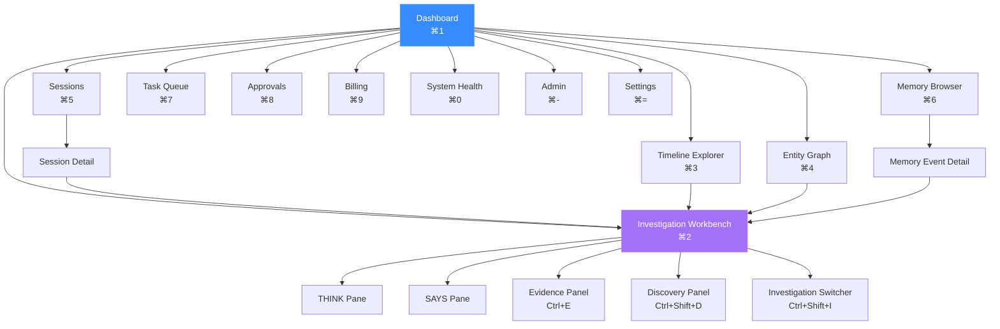

---

## 2. Investigation Workbench — THINK/SAYS Interaction Flow

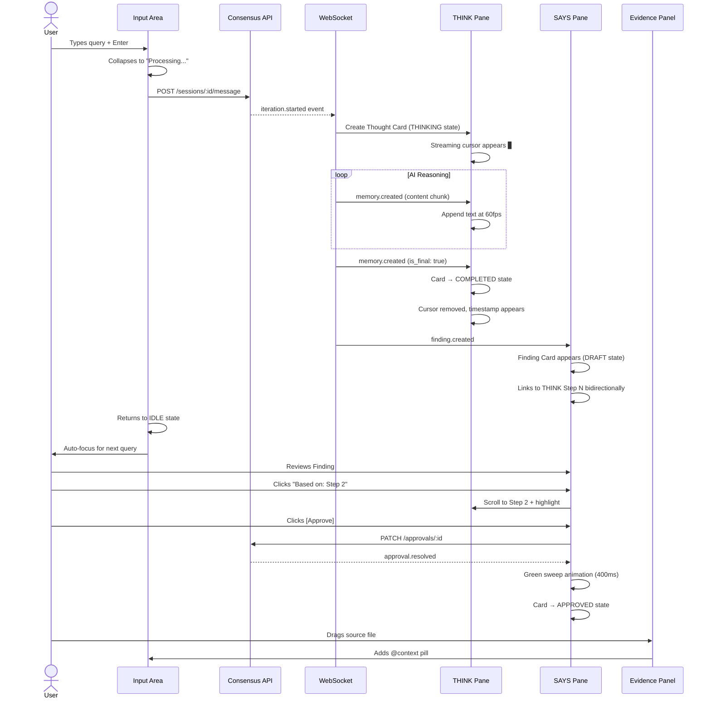

---

## 3. Session Lifecycle State Machine

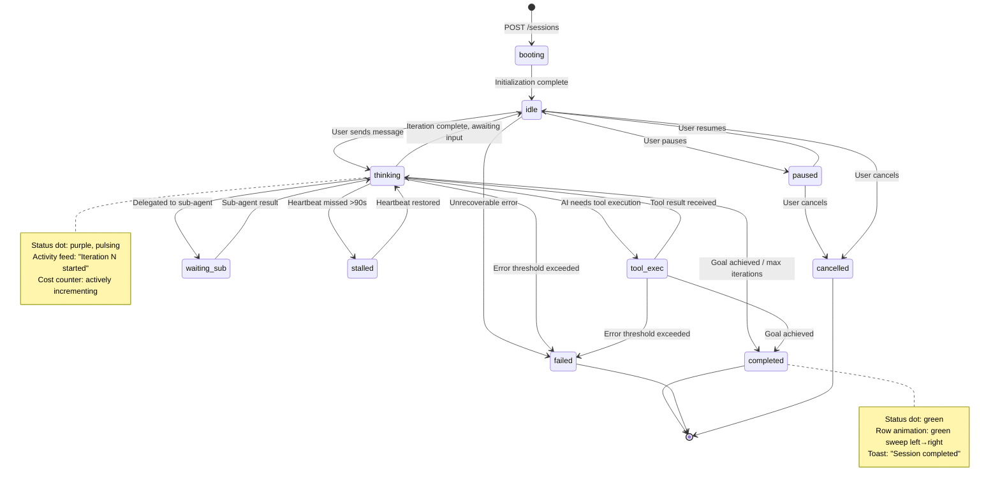

---

## 4. Finding Approval State Machine

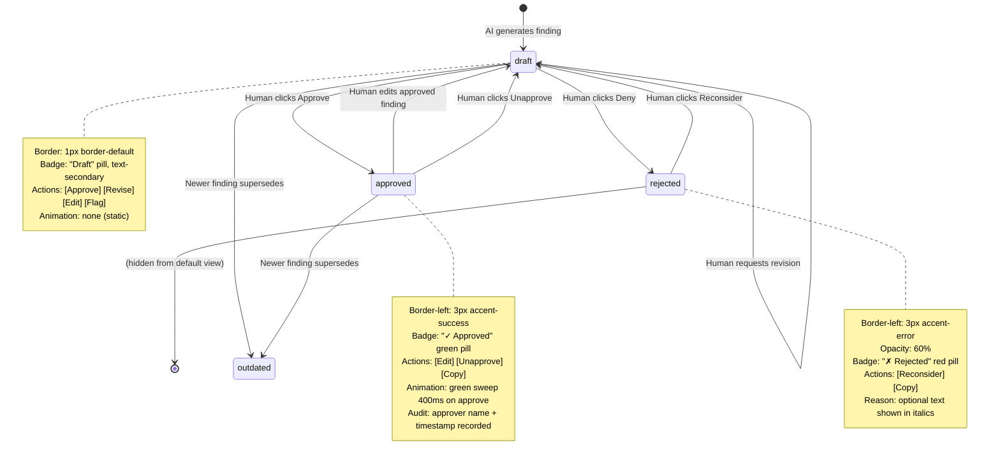

---

## 5. Data Flow Architecture — API + WebSocket + State

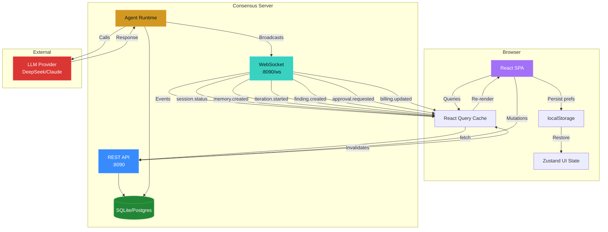

---

## 6. WebSocket Event Flow

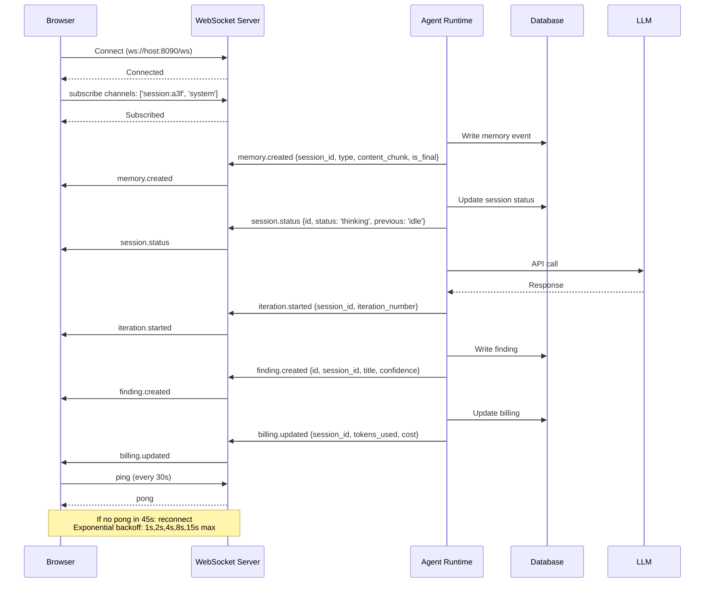

---

## 7. Command Palette — Search Flow

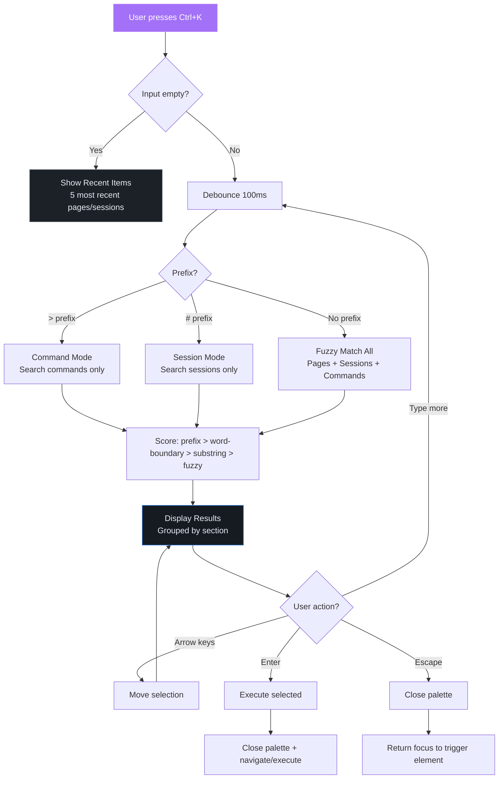

---

## 8. Component Hierarchy

```mermaid
graph TD
    App[App Shell]
    App --> TB[Top Bar]
    App --> SB[Sidebar]
    App --> Content[Content Area<br/>React Router Outlet]
    App --> StB[Status Bar]
    
    TB --> Logo[Logo]
    TB --> CP[Command Palette Trigger]
    TB --> Notif[Notification Bell]
    TB --> Profile[Profile Avatar]
    
    SB --> NavItems[Navigation Items<br/>10 routes]
    SB --> Collapse[Collapse Toggle]
    
    Content --> Dashboard[Dashboard Page]
    Content --> Workbench[Investigation Workbench]
    Content --> Timeline[Timeline Explorer]
    Content --> Graph[Entity Graph]
    Content --> Sessions[Sessions Page]
    Content --> Memory[Memory Browser]
    Content --> Tasks[Task Queue]
    Content --> Approvals[Approvals Page]
    Content --> Billing[Billing Page]
    Content --> Health[System Health]
    Content --> Admin[Admin Panel]
    Content --> Settings[Settings Page]
    
    Dashboard --> KPI[KPI Bar<br/>6 KPI Cards]
    Dashboard --> Feed[Activity Feed]
    Dashboard --> Recent[Recent Sessions]
    Dashboard --> Charts[Status Donut + Model Usage]
    
    Workbench --> ThinkPane[THINK Pane]
    Workbench --> Divider[Resizable Divider]
    Workbench --> SaysPane[SAYS Pane]
    Workbench --> Evidence[Evidence Panel]
    Workbench --> InputArea[Input Area]
    
    ThinkPane --> ThoughtCard[Thought Card<br/>× N per session]
    SaysPane --> FindingCard[Finding Card<br/>× N per session]
    
    ThoughtCard --> SourceBadge[Source Badge]
    ThoughtCard --> FlagIndicator[Flag Indicator]
    FindingCard --> ConfidenceBar[Confidence Bar]
    FindingCard --> ApprovalWorkflow[Approval Workflow]
    
    style App fill:#0d1117,stroke:#484f58,color:#e6edf3
    style Workbench fill:#a371f7,stroke:#c084fc,color:#fff
    style ThinkPane fill:#1c2128,stroke:#a371f7,color:#e6edf3
    style SaysPane fill:#1c2128,stroke:#238636,color:#e6edf3
```

---

## 9. Streaming Rendering Pipeline

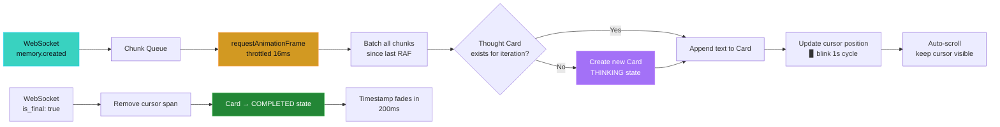

---

## 10. Approval Workflow — Full Sequence

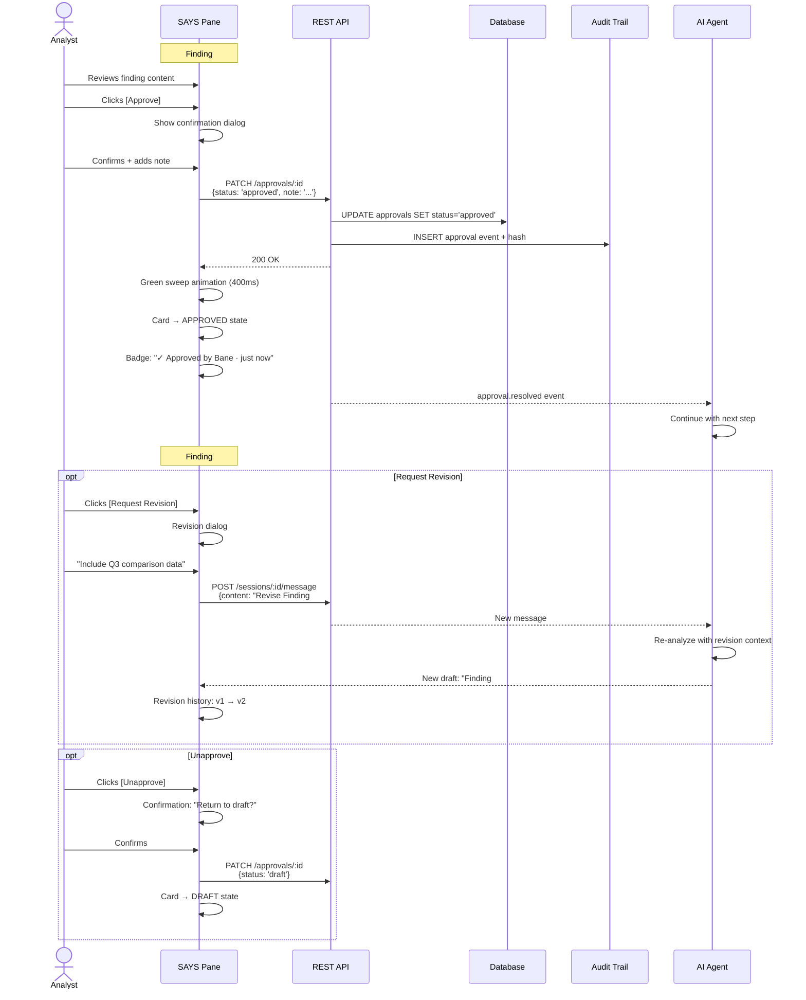

---

## 11. Error Recovery Flow

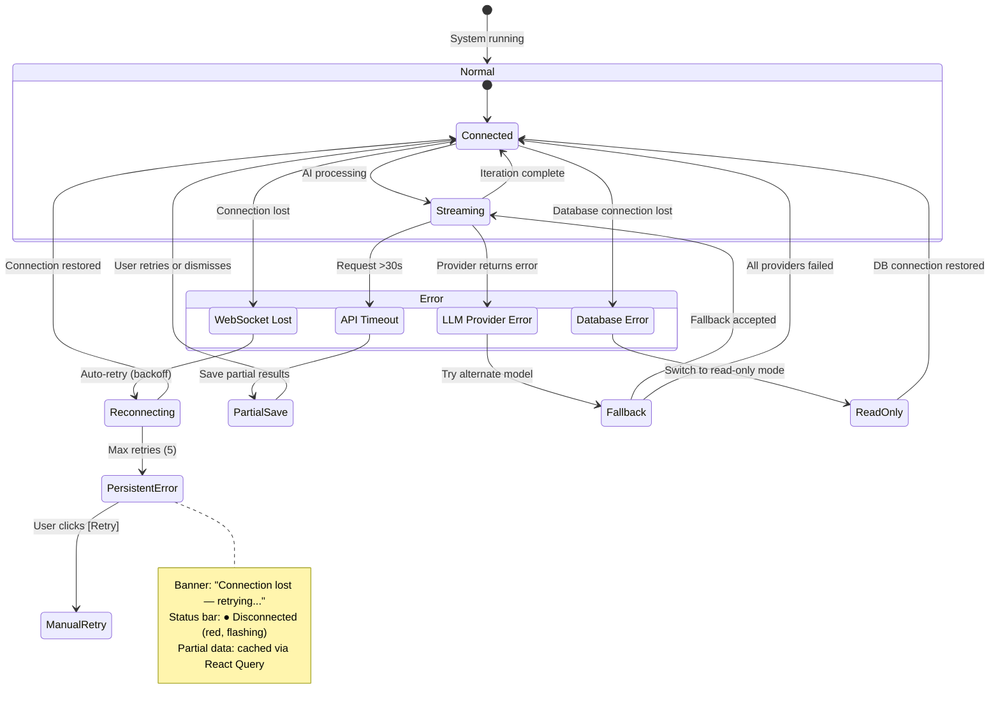

---

*Render these diagrams in VS Code (with Mermaid extension), GitHub (native support), or https://mermaid.live/*
